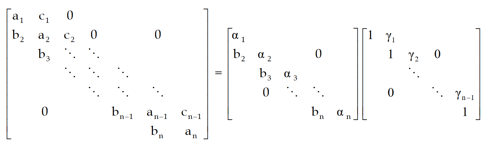
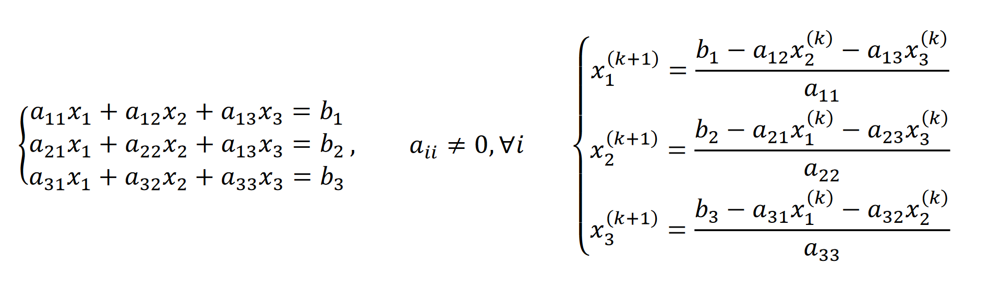

# 3. Risoluzione di Sistemi Lineari

[TOC]

## Definizione problema

Sia $A \in \R^{m \times n}$ e $b \in \R^m$ vogliamo trovare un vettore $x\in\R^n$ che soddisfi l'equazione $Ax=b$. 

Tratteremo solo sistemi quadrati, in cui esiste un'unica soluzione $x$ se e solo se:

*  esiste l'inversa $A^{-1}$ della matrice $A$
* oppure il rango della matrice $A$ è $n$
* oppure $Ax=0$ e in tal caso $x=0$

## Teorema di Cramer

Se il determinante della matrice è non nullo, allora esiste unica una soluzione del sistema, ed è data da: 
$$
x_i = \frac{\det(\Delta_i)}{\det(A)}
$$
Dove $\Delta_i$ è $A$ a cui sostituiamo l'$i$-esima riga con il vettore dei termini noti. 

## Numero di condizionamento nei sistemi lineari

Sia $A$ una matrice quadrata, il numero di condizionamento $k(A)$ della matrice è un valore che misura la sensibilità della soluzione di $Ax=b$ alle perturbazioni nei dati. Idealmente vorremmo lavorare con matrici con numero di condizionamento basso. Supponendo l'esistenza dell'inversa, $k(A)$ si calcola come segue: 
$$
k(A) = \|A\| \cdot \|A^{-1}\|
$$

> La matrice identità ha il più basso numero di condizionamento (1) ed è l'esempio perfetto di matrice ben condizionata nel caso della risoluzione di un sistema lineare associato. 

In generale, in numero di condizionamento è correlato all'errore sui dati come segue: 
$$
k(A) \ge \frac{\text{errore sul risultato}}{\text{errore sui dati}}
$$

### Problemi di calcolo del numero di condizionamento

La complessità del calcolo della matrice inversa cresce insieme alla crescita del numero di condizionamento. Ma per calcolare il numero di condizionamento è necessaria la matrice inversa! Affermiamo che: 

1. Se $k(A)$ è vicino ad 1 allora $k(A)$ è facilmente calcolabile
2. Se $k(A)$ è grande, allora è difficilmente ricavabile

### Correlazione tra numero di condizionamento e raggio spettrale

Supponendo l'esistenza dell'inversa, è presente la seguente relazione tra i due valori: 
$$
k(A) \ge \rho(A) \rho(A^{-1})
$$
Questo implica che:
$$
k(A) \ge \frac{\max \lambda}{\min \lambda}
$$
Banalmente al numeratore è presente il raggio spettrale di $A$. Sappiamo che se esiste $\lambda$ autovalore di $A$, allora $\lambda^{-1}$ è autovalore di $A^{-1}$. Dato che invertiamo tutti gli autovalori, l'autovalore più piccolo di $A$, una volta invertito, diventa l'autovalore più grande di $A^{-1}$: 
$$
\rho(A) \rho(A^{-1}) = \max \lambda \cdot \frac{1}{\min\lambda} = \frac{\max \lambda}{\min \lambda}
$$

### Matrice di Hilbert 

La matrice di Hilbert è un esempio di matrice mal condizionata per i sistemi lineari (ma è ben condizionata per altri problemi). In generale, l'elemento $h_{ij} = (i+j-1)^{-1}$, [approfondire qui](https://it.wikipedia.org/wiki/Matrice_di_Hilbert). 

## Metodi diretti

I metodi diretti trovano la soluzione del sistema lineare in un numero finito di passi. Sono adatti a sistemi con matrici piene, essendo che tendono a rimpire gli zeri della matrice. 

### Metodo delle sostituzioni in avanti

Supponiamo che la matrice $A$ del sistema sia triangolare inferiore. Il metodo delle sostituzioni in avanti risolve il sistema una soluzione per volta. Partendo da $x_1$ come segue: 
$$
x_1 = \frac {b_1} {l_{11}}
$$
Si calcola il generico $x_i$ 
$$
x_i = \frac{b_i - \sum_{j=1}^{i-1} l_{ij} x_j}{l_{ii}}
$$

### Metodo delle sostituzioni indietro

Supponiamo che la matrice $A$ del sistema sia triangolare superiore. Il metodo delle sostituzioni indietro risolve il sistema una soluzione per volta, partendo dal basso. Partendo da $x_n$ come segue: 
$$
x_n = \frac{b_n}{u_{nn}}
$$
Si calcola il generico $x_i$ 
$$
x_i = \frac{b_i - \sum_{j=i+1}^{n} u_{ij} x_j}{u_{ii}}
$$

### Complessità metodi di sostituzione e considerazioni

I metodi di sostituzione presentati eseguono circa $\frac{n(n+1)}{2}$ divisioni e moltiplicazioni e $\frac{n(n-1)}{2}$ somme algebriche, per un costo computazionale $\Theta(n^2)$. Per derivare la complessità basta osservare che nella prima iterazione facciamo 1 div/mul, nella seconda 2, nella terza 3 e così via. Avendo $n$ righe totali basta calcolare la somma dei primi $n$ numeri naturali, che corrisponde proprio alla prima formula mostrata.

Questi metodi sono molto leggeri, ma necessitano di matrici triangolari. Gli altri metodi presentati cercheranno di triangolarizzare la matrice, per poi utilizzare i metodi di sostituzione per risolvere il sistema lineare. Se dell'istanza del problema cambia solo il vettore dei coefficienti, è possibile precalcolarsi alcuni dei parametri per rendere il metodo più rapido. 

### Metodo di eliminazione naive di Gauss (MEG)

Supponendo che la matrice $A$ sia non degenere, e sia $a_{11} \ne 0$ (altrimenti scambia righe), allora è possibile applicare il metodo di Gauss (a meno di un'altra condizione che enunceremo dopo). Alla prima iterazione si calcolano i moltiplicatori: 
$$
m_{i1}^{(1)} = - \frac{a_{i1}}{a_{11}} \hspace{1cm} i=2, \dots, n
$$
Aggiungiamo alla $i$-esima equazione la prima equazione moltiplicata per $m_{i1}$. Così facendo andremo ad annullare tutti gli elementi della prima colonna meno che il primo. In generale, durante la $i$-esima iterazione lo scopo è a nnullare tutti gli elementi della $i$-esima colonna al di sotto dell'$i$-esimo, quindi si calcolano i moltiplicatori tramite l'elemento $a_{ii}$, che prende il nome di pivot: 
$$
m_{ji}^{(i)} = - \frac{a_{ji}}{a_{ii}} \hspace{1cm} j = i+1, \dots, n
$$
E si aggiunge l'$i$-esima equazione alle successive moltiplicata per il rispettivo moltiplicatore. Al passo $n-1$ si ottiene un sistema triangolare superiore che può essere risolto con la sostituzione all'indietro. Il costo computazionale del metodo è circa $\frac 4 3n^3$. 

Affinché il metodo funzioni è necessario che gli elementi della diagonale $a_{ii}$ siano non nulli ad ogni iterazione. Questo è garantito se tutti i minori principali di $A$ sono non nulli. 

### MEG con Pivot Parziale

La tecnica del pivot parziale evita le divisioni per zero o per numeri prossimi allo zero nel calcolo dei moltiplicatori. Alla $i$-esima iterazione si cerca la riga $i \le k \le n$ con l'elemento maggiore nella colonna $i$.
$$
a_{ki} = \max_{i \le s \le n} |a_{si}|
$$
Si sostituisce la riga $k$-esima con la riga $i$-esima. Il beneficio sta nel fatto che viene minimizzata la grandezza del moltiplicatore, minimizzando anche l'errore amplificato durante le moltiplicazioni. La complessità totale del metodo è $O(n^2)$. 

### MEG con Pivot Totale

Il pivot totale ha gli stessi benefici del pivot parziale, ma amplificati: il metodo può scegliere tra tutti gli elementi della matrice (incompleta) e non solo quelli della colonna analizzata. Il drawback sta nella complessità implementativa e nel cambio di variabile necessario. 

Supponiamo che il pivot corrente sia $a_{ii}$ e che l'elemento più grande della matrice sia $a_{rs}$. Allora prima si effettua una permutazione delle colonne $i \leftrightarrow s$ e si memorizza il cambio di variabile, e dopodiché si scambiano le righe $i \leftrightarrow r$. Quando si ottiene la soluzione, per ottenere la soluzione rispetto al problema originale bisogna applicare i cambi di variabile a ritroso alla soluzione. 

### Fattorizzazione LU

Sia $Ax=b$ il sistema lineare da risolvere, un metodo di fattorizzazione matriciale consiste nei seguenti passi:

1. Si trova una matrice $S$ non singolare tale che $SAx = Sb$ e $SA=U$ triangolare superiore.
2. Se $S$ è triangolare inferiore, lo sarà anche $S^{-1}$ e poniamo $L=S^{-1}$
3. Osserviamo che $A = LU = S^{-1} S A = A$ quindi $LU$ è una fattorizzazione di $A$

La fattorizzazione non dipende dai termini noti, quindi se nel sistema lineare in analisi variano solo i termini noti, precalcolando la fattorizzazione si ha un risparmio in efficienza. Attraverso la fattorizzazione LU riformuliamo il metodo di eliminazione di Gauss. Siano: 
$$
A = \begin{bmatrix}
a_{11} & a_{12} & \cdots & a_{1n} \\
a_{21} & a_{22} & \cdots & a_{2n} \\
\vdots & & \ddots \\
a_{n1} & a_{n2} & \cdots & a_{nn} \\
\end{bmatrix}

\hspace{1cm}

L_1 = \begin{bmatrix}
1      & 0 & \cdots & 0 \\
m_{21} & 1 & \cdots & 0 \\
\vdots &   & \ddots &   \\
m_{n1} & 0 & \cdots & 1
\end{bmatrix}
$$
dove $m_{i1}$ per $i=2, \dots, n$ sono i moltiplicatori mostrati in precedenza.  Il prodotto $L_1 A$ equivale al primo passo di Gauss. In generale, la matrice $L_i$ è definita come segue: 
$$
L_i = \begin{bmatrix}

1      & \dots &    0    		& \dots & 0 \\
\vdots &       & \vdots  		&       & \vdots  \\
0      & \dots &    1    		& \dots & 0 \\
0      & \dots &    m_{i+1,i} 	& \dots & 0 \\
\vdots &       & \vdots  		&       & \vdots  \\
0      & \dots &    m_{n,i} 	& \dots & 1 \\
\end{bmatrix}
$$
Alla fine si ha: 
$$
U = L_{n-1} L_{n-2}\dots L_2 L_1 A
$$
Poniamo $\tilde{L} = L_{n-1} L_{n-2}\dots L_2 L_1$, quindi $U = \tilde{L}A$. Poniamo $L= \tilde{L}^-1$ e osserviamo che: 
$$
LU = \tilde{L}^{-1} U = \tilde{L}^{-1} \tilde{L}A = A
$$
Adesso, la soluzione del sistema lineare $Ax=b$ si risolve in due passaggi: 

1. $Ly = b$ e si risolve per $y$
2. $Ux = y$ e si risolve per $x$

Questo poiché con il passo (1) si trova $y=L^{-1}b$, mentre con il passo 2 si trova $x=U^{-1}L^{-1}b$, che è sicuramente soluzione del sistema $Ax=LUx=b$, ed entrambi possono essere risolti con sostituzioni in avanti ed indietro, essendo matrici triangolari inferiori (L) e superiori (U). 

Non sempre esiste una fattorizzazione LU della matrice. Condizione necessaria di esistenza è che la matrice sia non degenere, quindi che abbia il determinante non nullo. Se vale tale condizione, allora esiste sicuramente una matrice di permutazione $P$ tale che $PA=LU$.  L'esistenza è garantita per le matrici **diagonalmente dominanti** e **simmetriche definite positive**, senza dover permutare la matrice. 

#### Matrici di permutazione

Le tecniche del pivot parziale e totale possono essere implementate nella forma matriciale del metodo di eliminazione di Gauss attraverso delle matrici di permutazione. Una matrice di permutazione è una matrice ottenuta scambiando righe o colonne della matrice identità. In particolare, scambiando la riga $i$ con la riga $j$ di $I$ e 

* premoltiplicandola per $A$ si scambiano le righe
* postmoltiplicandola per $A$ si scambiano le colonne

Esempio: scambiamo la riga 1 e la riga 3 della matrice identità e vediamo cosa succede se la premoltiplichiamo ad una matrice qualunque: 
$$
\begin{bmatrix}
0 & 0 & 1 \\
0 & 1 & 0 \\
1 & 0 & 0
\end{bmatrix}
\cdot
\begin{bmatrix}
4 & 2 & 7 \\
6 & 2 & 9 \\
7 & 3 & 5
\end{bmatrix}
= 
\begin{bmatrix}
7 & 3 & 5 \\
6 & 2 & 9 \\
4 & 2 & 7
\end{bmatrix}
$$
L'effetto è stato uno scambio di righe. Se invece postmoltiplichiamo la matrice di permutazione:
$$
\begin{bmatrix}
4 & 2 & 7 \\
6 & 2 & 9 \\
7 & 3 & 5
\end{bmatrix}
\cdot
\begin{bmatrix}
0 & 0 & 1 \\
0 & 1 & 0 \\
1 & 0 & 0
\end{bmatrix}
= 
\begin{bmatrix}
7 & 2 & 4 \\
9 & 2 & 6 \\
5 & 3 & 7
\end{bmatrix}
$$
L'effetto è stato uno scambio di colonne. 

#### Metodo di Doolittle e di Croud

Se esplicitassimo il sistema lineare $LU=A$ avremmo $n^2$ equazioni (una per ogni elemento di $A$) ed $n^2+n$ incognite (elementi di $L$ ed $U$ supponendo che siano rispettivamente triangolari inferiore e superiore), questo implica che abbiamo $n$ gradi di libertà, ovvero la fattorizzazione $LU$ non è unica. 

I seguenti metodi eliminano i gradi di liberta imponendo dei vincoli:

* **Doolittle**: si fissa $l_{ii} = 1$ in $L$ (equivalente a eliminazione gaussiana senza pivot) 
* **Crout**: si fissa $u_{ii} = 1$ in $U$  

#### Effetto Fill-in

I metodi di fattorizzazione modificano la matrice iniziale causando un effetto fill-in, ovvero gli zeri diventano elementi non nulli. Se la matrice è inizialmente sparsa, conviene optare per metodi iterativi. 

### Metodo di Cholesky

Sia $A \in \R^{n \times n}$ una matrice simmetrica ($A = A^T$) e definita positiva, allora esiste almeno una matrice $L$ triangolare inferiore tale che $A=LL^T$. Inoltre, se si impone che $l_{ii} > 0$ la fattorizzazione è unica. 

**Dimostrazione (costruttiva)**. 

Per il criterio di Sylvester, la matrice ha determinante strettamente positivo, e quindi esiste una fattorizzazione LU. Proviamo a costruire la fattorizzazione $U^TU$ come segue: 
$$
U^T U =
\begin{bmatrix}
u_{11} & & 0 \\
\vdots & \ddots & \\
u_{1n} & \dots & u_{nn}
\end{bmatrix}
\begin{bmatrix}
u_{11} & \dots  & u_{1n} \\
\vdots & \ddots & \\
0 & \dots & u_{nn}
\end{bmatrix}
= 
\begin{bmatrix}
a_{11} & \dots  & a_{1n} \\
\vdots & \ddots & \\
a_{n1} & \dots & a_{nn}
\end{bmatrix}
= A
$$
Dato che le incognite sono gli elementi di $U$, che sono $n(n+1)/2$, possiamo strutturare $n^2$ equazioni (non lineari) tramite il prodotto riga-colonna. 

Esplicitiamo il calcolo dell'elemento $a_{kj}$ supponendo che $k > j$ (le moltiplicazioni per indici maggiori di $j$ sono nulle per la triangolarità delle matrici), quindi abbiamo: 
$$
a_{kj} = \sum_{i=1}^{j} u_{ki} u_{ij} = 
u_{kj}u_{jj} + \sum_{i=1}^{j-1} u_{ki} u_{ij}
$$
Estraiamo l'elemento $u_{kj}$ dall'equazione: 
$$
u_{kj} = \frac{a_{kj} - \sum_{i=1}^{j-1} u_{ki} u_{ij}}{u_{jj}}
$$
Vediamo invece come calcolare un elemento della diagonale $u_{kk}$. Tramite la seguente equazione cerchiamo di calcolare l'elemento $a_{kk}$: 
$$
a_{kk} = \sum_{p=1}^k u^2_{pk} = u^{2}_{kk} + \sum_{p=1}^{k-1} u^2_{pk}
$$
Oss. la sommatoria termina a $k$ e non ad $n$ perché per la struttura triangolare della matrice gli elementi $a_{k, k+1}, \dots, a_{k, n}$ sono nulli. Ora possiamo estrapolare l'elemento $u_{kk}$ come: 
$$
u_{kk} = \sqrt{a_{kk} - \sum_{p=1}^{k-1} u^2_{pk}}
$$
Calcolando $u_{11}$ la sommatoria verrebbe annullata, quindi $u_{11} = \sqrt{a_{11}}$. Bisogna seguire un certo andamento per poter calcolare tutti gli elementi di $U$, dato che un calcolo potrebbe richiedere dei calcoli di altri elementi della matrice. Nella seguente foto è illustrato tale andamento su una matrice $3\times 3$: 

### Algoritmo di Thomas

L'algoritmo di Thomas è un TDMA (tridiagonal matrix algorithm), ovvero un algoritmo che opera su matrici tridiagonali. Una matrice tridiagonale di dimensione $n \times n$ ha $3n-2$ elementi. Scriviamola come prodotto di due matrici particolari, in cui le incognite sono $\alpha_i$ per $i=1, \dots, n$ e $\gamma_i$ per $i=1, \dots, n-1$. 

I coefficienti sono determinabili come segue: 

* $\alpha_1 = a_1$ e $\alpha_i = a_i - b_i\gamma_{i-1}$ per $i=2, \dots, n$
* $\gamma_1 = c_1 / \alpha_1$ e $\alpha_i = c_i / \alpha_i$ per $i = 2, \dots,n-1$

Per una trattazione completa consultare il [seguente documento](https://www.cfd-online.com/Wiki/Tridiagonal_matrix_algorithm_-_TDMA_(Thomas_algorithm)).

## Metodi iterativi

Un metodo iterativo produce una successione di soluzioni che, sotto opportune condizioni, converge alla soluzione reale. Comunemente si parte da una soluzione randomica $x^{(0)}$, in quanto si dimostra che il metodo converge comunque. 

### Descrizione generale di un algoritmo iterativo

Sia $A \in \R^{n \times n}$ una matrice non degenere, si impone che: 
$$
\begin{cases}
Ax=b \\
A = M-N
\end{cases}
$$
Quindi si ha: 
$$
\begin{split}
Ax &=b \\
(M-N)x &= b \\
Mx - Nx &= b \\
Mx^{(k+1)} &= Nx^{(k)} + b
\end{split}
$$
E quindi si determina la soluzione al passo $k+1$ dalla soluzione al passo precedente: 
$$
x^{(k+1)} = M^{-1}Nx^{(k)} + M^{-1}  b
$$
L'equazione $A = M-N$ prende il nome di decomposizione, e si dice regolare se $M$ non è degenere e gli elementi dell'inversa $M^{-1}$ e di $N$ sono tutti maggiori di zero. 

### Metodo iterativo convergente

Un metodo iterativo si dice convergente se per qualunque vettore iniziale $x^{(0)}$ il metodo sarà convergente. 

#### Teorema sulla convergenza (1)

Sia $A = M-N$ una decomposizione regolare di $A$ e sia $\|M^{-1}N\| \le \lambda < 1$. Allora:

1. $A$ non è singolare
2. Il metodo iterativo associato alla decomposizione è convergente
3. $\|x^{(k)} - x\|$ ci dà un limite all'errore commesso

#### Teorema sulla convergenza (2)

Condizione necessaria e sufficiente affinché il metodo iterativo sia convergente è che il raggio spettrale $\rho$ della matrice $M^{-1}N$ sia minore di 1: 
$$
\rho(M^{-1}N) < 1
$$

#### Corollario sulla convergenza (3)

Dato che il determinante di una matrice è anche definito come il prodotto dei suoi autovalori, allora condizione necessaria affinché il metodo converga è che
$$
|\det(M^{-1}N)| < 1
$$
Se il determinante è maggiore di 1 allora esiste almeno un autovalore $\ge 1$, e quindi il metodo non può convergere per il teorema precedente.

#### Corollario sulla convergenza (4)

La traccia di una matrice è definita come la somma dei suoi autovalori. Condizione necessaria affinché il metodo converga è che: 
$$
|t_r(M^{-1}N)| < n
$$
Se vale il contrario, allora almeno uno degli autovalori è $\ge 1$, quindi il metodo non può convergere per il teorema precedente. 

#### Correlazione tra raggio spettrale e convergenza

Il raggio spettrale $\rho$ relativo alla matrice di uno specifico metodo è correlato alla convergenza dello stesso come segue: 

* Se $\rho \ge 1$ il metodo diverge
* Se $\rho < 1$ il metodo converge
* Tanto più $\rho$ si avvicina ad 1, tanto più il metodo convergerà lentamente

### Metodo di Jacobi

Partendo da una soluzione iniziale $x^{(0)}$, la soluzione $x^{(k)}$ si determina dalla soluzione $x^{(k-1)}$ come segue: 

 

