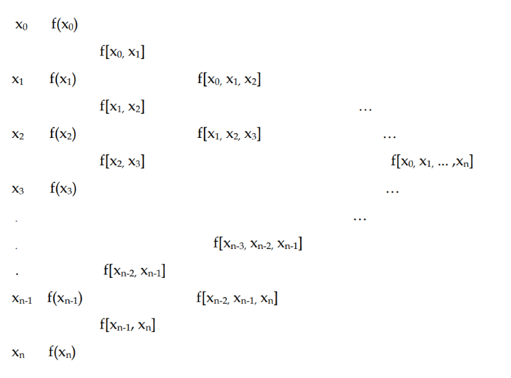
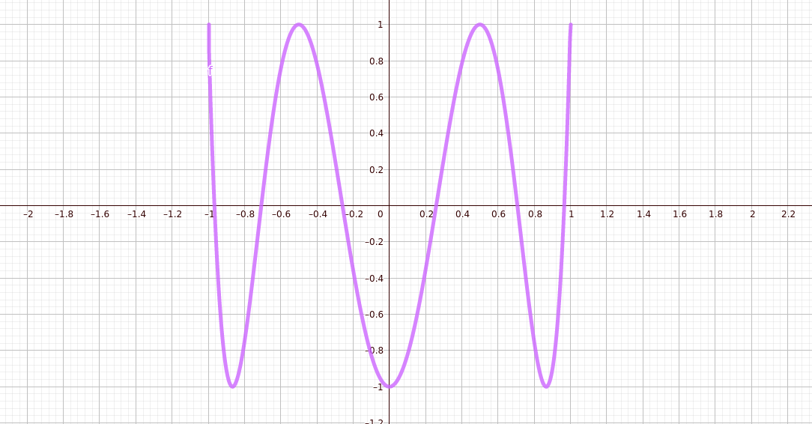

# 4. Interpolazione

[TOC]

## Definizione del problema

È un problema di approssimazione di una funzione o di un insieme di dati con una funzione che sia più semplice e che abbia buone proprietà di regolarità. È utilizzata quando i dati sono forniti con precisione. La **condizione di interpolazione** è che la funzione interpolante e la funzione interpolata coincidano nei nodi che sono le ascisse dei dati.

## Interpolazione polinomiale

Nell'interpolazione polinomiale la funzione interpolata sarà un polinomio. Con $P_n$ indicheremo l'insieme dei polinomi di grado minore o uguale ad $n$. 

### Teorema di Vandermonde

Siano dato gli $n+1$ nodi $x_0, \dots, x_n$ distinti ed i dati in corrispondenza $y_0, \dots, y_n$, allora esiste sempre uno ed un solo polinomio interpolante di grado $n$ passante per tutti i punti $x_i$.
$$
\exist_1 p \in P_n : p(x_i) = y_i \hspace{1cm} i=0, 1, \dots, n
$$

### Metodo dei coefficienti indeterminati

Anche detto metodo di Vandermonde, consiste nel ricavare il polinomio risolvendo un sistema lineare. Un polinomio $p \in P_n$ ha $n+1$ coefficienti, che sarebbero le incognite. Se abbiamo $n+1$ nodi allora possiamo facilmente costruire un sistema lineare quadrato per ottenere i coefficienti del polinomioì, e quindi un polinomio che rispetti la condizione di interpolazione. 
$$
\begin{cases}
a_0 + a_1 x_0^{1} + \dots + a_n x_0^{n} = y_0 \\
a_0 + a_1 x_1^{1} + \dots + a_n x_1^{n} = y_1 \\
\vdots \\
a_0 + a_1 x_n^{1} + \dots + a_n x_n^{n} = y_n \\
\end{cases}
$$
Purtroppo il metodo genera una matrice mal condizionata per il problema dei sistemi lineari al crescere di $n$. Esistono metodi migliori per il problema dell'interpolazione. 

### Metodo dei polinomi di Lagrange

Si pone il polinomio $p \in P_n$ alla seguente espressione: 
$$
p(x) = \sum_{i=0}^{n} y_i L_i(x)
$$
Dove gli $L_i$ sono i polinomi di Lagrange e sono definibili come una base dello spazio dei polinomi $P_n$, mentre nei casi precedenti viene usata la base canonica ($1, x, x^2, \dots, x^n$). La costruzione avviene come segue: 
$$
L_i(x) = \prod_{j\ne i, j=0}^n \frac{x - x_j}{x_i - x_j}
$$
Il comportamento di $L_i$ con i nodi è quello di un interruttore: 
$$
Li(x_j) = \begin{cases}
0 & x \ne x_i\\
1 & x = x_i
\end{cases}
$$
Quindi è ovvio che il polinomio definito precedentemente interpola i nodi, essendo che quando è sottomesso a $x_i$ si attiva $L_i(x_i)=1$ e si annullano tutti gli altri, quindi $p(x_i) = y_i L_i(x_i) = y_i$.  

### Metodo delle differenze divise di Newton

Anche in questo metodo si utilizza una base differente, e si crea $p \in P_n$ come segue: 
$$
p(x) = b_0 + b_1(x - x_0) + b_2(x-x_0)(x-x_1) + \dots +
b_n\prod_{i=0}^{n-1}(x - x_i)
$$
Osserviamo che:

1. $p(x_0) = b_0$
2. $p(x_1) = b_0 + b_1(x-x_0)$
3. etc.

Le espressioni successive si annullano a causa di moltiplicazioni per $0$. Una volta osservato questo, bisogna calcolare i termini $b_i$ imponendo che sia soddisfatta la condizione di interpolazione. Per il primo nodo si ha: 
$$
p(x_0) = b_0 = y_0 \Longrightarrow b_0 = y_0
$$
Vediamo cosa succede per il secondo nodo: 
$$
p(x_1) = b_0 + b_1(x_1-x_0) = y_1
$$
Quindi: 
$$
b_1 = \frac{y_1 - b_0}{x_1 - x_0} = \frac{y_1 - y_0}{x_1 - x_0}
$$
Questo termine, che somiglia al rapporto incrementale, prende il nome di **prima differenza divisa**
$$
f[x_0, x_1] = \frac{y_1 - y_0}{x_1 - x_0}
$$
In generale, si ha che per $0 < i \le n$ il termine $b_i$ corrisponde alla differenza divisa: 
$$
b_i = f[x_0, x_1, \dots, x_i]
$$

#### Calcolo delle differenze divise

Un trucco per calcolare le differenze divise è quello di creare una tabella piramidale come segue: 

Sia $P$ la tabella piramidale, con $P[i, j]$ ci riferiamo all'elemento $i$ della colonna $j$. Possiamo riempire la colonna calcolando gli elementi come segue (dalla 3° colonna in poi, dato che le prime due sono note): 
$$
P[i, j] = \frac{P[i-1, j] - P[i-1, j+1]}{P[0, j+i] - P[0, j]}
$$
Le differenze divise che ci interessano stanno nella prima riga della tabella, quindi $P[i, 0]$ per $i=1, \dots, n$, quindi in generale: 
$$
b_i = P[i, 0]
$$

### Metodo delle differenze

Deriva dal metodo delle differenze divise e si adotta solo nel caso in cui i nodi sono **ugualmente spaziati** tra loro, e quindi data una spaziatora $h$ si può definire una relazione: 
$$
x_i = x_0 + hi
$$
Se anziché considerare le differenze divise, considerassimo solo le differenze, allora potremmo definire ricorsivamente il seguente schema: 
$$
\begin{cases}
\Delta^0 f(x) &= f(x) \\
\Delta^1 f(x) &= \Delta(\Delta^0 f(x)) = f(x+h) - f(x) \\
\Delta^i f(x) &= \Delta(\Delta^{i-1}f(x))
\end{cases}
$$
Per capire meglio come funzionano, calcoliamo $\Delta^2 f(x)$: 
$$
\begin{split}
\Delta^2 f(x) &= \Delta(\Delta^1 f(x)) \\
&= \Delta(f(x+h) - f(x)) \\
&= \Delta f(x+h) - \Delta f(x) \\
&= f(x+2h) - f(x+h) - f(x+h) + f(x)) \\
&= f(x+2h) + 2 f(x+h) + f(x)
\end{split}
$$
Si può effettuare il calcolo delle differenze attraverso la tabella, ma senza dividere:
$$
P[i, j] = P[i-1, j] - P[i-1, j+1]
$$

 #### Teorema 

Se i nodi sono equispaziati, allora vale che: 
$$
f[x_i, \dots, x_{i+k}] = \frac{\Delta^k f(x)}{k! h^k}
$$
e vale anche la seguente formula per il calcolo del polinomio interpolante: 
$$
p(x) = p(x_0 + rh) = \sum_{j=0}^n \left[\Delta^j f(x_0) \binom{r}{j}\right]
$$
Dove $r$ è ottenuto come $r = (x - x_0) / h$. Tramite questa formula è possibile ignorare completamente il calcolo dei coefficienti $b_i$ e valutare il polinomio interpolante in un qualsiasi punto (previa costruzione della tabella che determina le differenze $\Delta^j f(x_0)$). 

### Problemi legati all'interpolazione polinomiale

Un polinomio di grado troppo alto continuerà ad interpolare i nodi, ma tra un punto ed il successivo oscillerà in maniera crescente al crescere di $n$. Vedremo come rimediare quando studieremo le splines. 

## Interpolazione Lagrangiana

I metodi presentati sino ad ora sono metodi di interpolazione polinomiale lagrangiana. In questi metodi non viene specificato come deve avvenire il passaggio per i punti interpolati, ad esempio sfruttando informazioni relative alle derivate. 

### Teorema dell'errore nei metodi di interpolazione lagrangiani 

> Il teorema vale per qualsiasi metodo di interpolazione Lagrangiana. 

Sia $f : [a, b] \to \R$ la funzione da interpolare e siano dati $n+1$ nodi $x_0, \dots, x_n$. Sia $f \in C[a,b]^{n+1}$ ovvero siano continue le $n+1$ derivate di $f$. Sia $p \in P_n$ il polinomio interpolante $f$ nei nodi stabiliti. Allora l'errore vale esattamente 
$$
e(x) = f(x)- p(x) = \frac{f^{n+1}(\xi)}{(n+1)!} W(x) \hspace{1cm} \forall x \in [a,b]
$$
Con $\xi \in ]a,b[$ e $W\in P_{n+1}$ definito come segue
$$
W(x) = \prod_{i=0}^n (x-x_i)
$$
Anche se non viene detto come determinare il termine $\xi$, è comunque possibile studiare l'errore massimo che si può commettere utilizzando il polinomio ottenuto tramite interpolazione lagrangiana: 
$$
\max(e) = \max(f(x) - p(x)) = \frac{\max f^{n-1}}{(n+1)!} \max W
\hspace{1cm} \forall x \in [a,b]
$$
**Dimostrazione del teorema**. 

Nel caso in cui $x$ sia un nodo $x_i$, allora l'espressione è banalmente vera: per la condizione di interpolazione l'errore è nullo. Questo è vero sia nell'espressione $f(x) -  p(x)$, sia in quella seguente, dato che $W(x)$ si annulla quando $x$ è un nodo. 

Fissiamo $x$ e ipotizziamo che non sia uno dei nodi. Definiamo una funzione ausiliaria: 
$$
F(t) = f(t) - p(t) - \frac{f(x) - p(x)}{W(x)} W(t)
$$
La funzione $F(t)$ ha esattamente $n+2$ zeri:

*  $n+1$ zeri sono dati dalla componente $W(t)$ che si annulla sugli $n+1$ nodi
* 1 zero è dato per $t=x$ 

La funzione $F$ è differenziabile $n+1$ volte poichè è composta da: 

* $f$ che è differenziabile $n+1$ volte per ipotesi
* $W$ e $p$ che essendo polinomi sono differenziabili infinite volte

Il teorema di Rolle enuncia che sotto opportune condizioni (funzione continua e derivabile (esterni esclusi) nel dominio) se $f(a) = f(b)$ allora esiste $c \in Dom(F)$ tale che $f'(c)=0$. Dato che: 
$$
F(x_i) = F(x_{i+1}) = 0
$$
Allora in ogni intervallo $]x_i, x_{i+1}[$ tra due nodi consecutivi contiene un punto al suo interno per cui la derivata prima $F'$ si annulla. Essendoci $n+1$ nodi, questo ragionamento può essere applicato ai rispettivi $n$ intervalli, quindi la derivata prima $F'$ ha $n+1$ zeri. 

Se si reitera il ragionamento otterremo che: 

- $F$ ha $n+2$ zeri
- $F'$ ha $n+1$ zeri
- $F''$ ha $n$ zeri
- $\dots$
- $F^{n+1}$ ha uno zero, che chiameremo $\xi$

Una volta chiarito qual è lo $\xi$ a cui ci riferiamo, osserviamo come calcolare la formula della tesi. 

Lo scopo è quello di calcolare la derivata $(n+1)$-esima di $F$. La $f$ è per ipotesi derivabile $(n+1)$ volte, quindi si calcola la derivata. Il polinomio $p \in P_n$ si annulla derivandolo $n+1$ volte. Il termine $W(t)$ è tale che: 
$$
W(t) = \prod_{i=0}^{n} (t-x_i) = t^{n+1} + a_0t^n + a_1 t^{n-1} + \dots + a_{n+1}
$$
Osserviamo che il polinomio è **monico**, ovvero il coefficiente del monomio di grado massimo è 1. La derivata $(n+1)$ di un polinomio monico di grado $n+1$ è semplicemente: 
$$
W^{(n+1)}(t) = (n+1)!
$$

> Piccolo hint: deriviamo $x^4$ 4 volte: $4x^3 \to (3 * 4)x^2 \to (2*3 *4)x \to (1*2*3*4) = 4!$

Infine ricomponiamo la derivata $F^{(n+1)}$
$$
F^{(n+1)}(t) = f^{n+1}(t) - \frac{f(x) - p(x)}{W(x)} (n+1)!
$$
Inseriamo $t=\xi$ facendo così annullare la derivata $(n+1)$-esima: 
$$
F^{(n+1)}(\xi) = f^{n+1}(\xi) - \frac{f(x) - p(x)}{W(x)} (n+1)! = 0
$$
Riordiniamo l'espressione: 
$$
\begin{split}
f^{n+1}(\xi) - \frac{f(x) - p(x)}{W(x)} (n+1)! &= 0 \\
-\frac{f(x) - p(x)}{W(x)} (n+1)! &= -f^{n+1}(\xi) \\
\frac{f(x) - p(x)}{W(x)} (n+1)! &= f^{n+1}(\xi) \\
f(x) - p(x) &= \frac{f^{n+1}(\xi)}{(n+1)!} W(x)
\end{split}
$$
Da cui la tesi: 
$$
e(x) = f(x) - p(x) = \frac{f^{n+1}(\xi)}{(n+1)!} W(x)
$$

#### Corollario (correlazione tra errore e differenze divise)

Dal teorema sull'errore e dalle formule delle differenze divise di Newton si ha: 
$$
f[x_0, \dots, x_{n+1}] = \frac{f^{(n+1)}(\xi)}{(n+1)!}
$$

## Interpolazione Hermitiana

L'interpolazione hermitiana tiene conto dell'informazione fornita dalle derivate della funzione interpolata. Siano $x_0, \dots, x_n$ gli $n+1$ nodi, se oltre alla valutazione della funzione nel generico nodo $f(x_i)$ vengono fornite anche le derivate $f'(x_i), f''(x_i), \dots$ allora si può imporre un passaggio più accurato del polinomio approssimante in quel punto. 

### Buchi di informazione

Per funzionare, non devono esserci buchi nell'informazione fornita. Per buco intendiamo ad esempio che venga fornita la derivata prima nel punto $x_i$, ma non il valore della funzione, oppure che venga fornito il valore della derivata seconda e non della derivata prima (etc). Se le informazioni contengono buchi, allora la matrice del sistema lineare associato (Vendermonde) sarà degenere. Se invece non ci sono buchi, quindi per ogni derivata $n$-esima fornita sono state fornite le derivate precedenti ed il valore della funzione valutata sul punto, allora la matrice sarà non degenere e sarà possibile calcolare il polinomio. 

### Grado del polinomio interpolante

Supponiamo che siano forniti: 

* $n+1$ nodi
* $m_0$ valori 
* $m_1$ derivate prime
* $\dots$ 
* $m_n$ derivate $n$-esime 

Allora il grado del polinomio interpolante calcolato attraverso interpolazione hermitiana sarà 
$$
N = \left(\sum_{i=0}^n m_i\right) - 1
$$

 ### Interpolazione osculatoria

Questo tipo di interpolazione è un caso particolare dell'interpolazione hermitiana, in cui si hanno a disposizione tutti le informazioni di derivate prime oltre che ai valori della funzione nei vari nodi. 

### Estensione dei teoremi sull'errore

I teoremi sull'errore dell'interpolazione lagrangiana precedentemente enunciati valgono anche in questo caso, con l'unica differenza che nella funzione $W(x)$, se si conosce fino alla derivata $n$-esima di un certo nodo $x_i$, il termine $(x-x_i)$ deve essere elevato alla $n$.   

## Disposizione dei nodi

> Per semplicità lavoreremo sulla interpolazione lagrangiana, ma vale anche per quella hermitiana. 

All'aumentare del grado del polinomio, esso oscilla tra i nodi imposti durante l'interpolazione. Questo effetto può essere rilassato andando a giocare sulla disposizione dei nodi, utilizzando quindi dei nodi non equispaziati (campionamento non uniforme). 

### Triangolazione

Fissata una tipologia di campionamento (uniforme oppure non uniforme) e fissato $n$, la triangolazione $\Delta$ di un certo intervallo $[a,b]$ produce una sequenza di campionamenti $C_1, C_2, \dots, C_n$ di cardinalità $|C_i| = i$.  Andando a produrre il polinomio interpolante per ognuno dei campionamenti, si spera che all'aumentare del numero di campioni il polinomio converga alla funzione interpolata $f:[a,b]\to \R$. 

### Teorema di Faber

Per ogni triangolazione $\Delta$ esiste una funzione $f \in C[a,b]$ per cui la successione di polinomi $\{p_n(x)\}$ non converge uniformemente ad $f(x). 

> Esempio: funzione di Runge $f(x) = 1 / (1+x^2)$ con $x \in[-5,5]$ con campionamento omogeneo. 

### Teorema dell'esistenza della triangolazione ottima 

Data $f \in C[a,b]$ allora esiste una triangolazione $\Delta$ tale che la successione $\{p_n(x)\}$ converge uniformemente ad $f(x)$. 

### Conseguenze dei teoremi

* Non esistono schemi interpolatori universali. 
* Dalla formula dell'errore l'unica cosa che possiamo manipolare è il campionamento

### Polinomi di Chebichev

I polinomi di Chebichev sono una classe di polinomi $T_n(x)$ di grado $n$ utili alla ricerca dei nodi ottimali presso i quali campionare non uniformemente una qualsiasi funzione che si intende interpolare tramite interpolazione polinomiale. Si lavorerà ipotizzando che il dominio della funzione interpolata sia $[-1, 1]$, in caso contrario, sarà possibile mappare il risultato nel dominio originale della funzione. 

I polinomi di Chebichev sono definiti come segue: 
$$
\begin{cases}
T_n(x) = \cos(n\theta) \\ 
x = \cos(\theta) 
\end{cases}
$$
Quindi per valutare $T_n(x)$ bisogna prima calcolare $\theta = arccos(x)$, e dopodiché $T_n(x) = \cos(n\theta)$. Notiamo che: 

- Per $n=0$ si ha $T_0(x) = \cos(0) = 1$
- Per $n=1$ si ha $T_1(x) = \cos(\theta) =^{def} x$ 

Otteniamo il polinomio per $n=k+1$ ed $n=k-1$ ed utilizziamo [le formule di sommazione degli angoli per il coseno](https://www.youmath.it/formulari/65-formulari-di-trigonometria-logaritmi-esponenziali/159-identita-trigonometriche-formule-di-prostaferesi-formule-di-werner.html): 
$$
T_{k+1}(x) = \cos((k+1)\theta) = \cos(k\theta + \theta) = 
\cos(k\theta)\cos(\theta) + \cos(k\theta)\cos(\theta) \\

T_{k-1}(x) = \cos((k-1)\theta) = \cos(k\theta - \theta) = 
\cos(k\theta)\cos(\theta) - \cos(k\theta)\cos(\theta)
$$
Sommiamo i polinomi e manipoliamo l'equazione: 
$$
\begin{split}
T_{k+1}(x) + T_{k-1}(x) &= 2\cos(k\theta)\cos(\theta) \\
T_{k+1}(x) &= 2\cos(k\theta)\cos(\theta) - T_{k-1}(x) \\
T_{k+1}(x) &= 2x \cdot T_k(x) - T_{k-1}(x)
\end{split}
$$
Dove sostituiamo $x=\cos(\theta)$ e $T_k = \cos(k\theta)$. Possiamo definire i polinomi di Chebichev ricorsivamente come segue:
$$
\begin{cases}
1 & n=0 \\
x & n=1 \\
2x \cdot T_k(x) - T_{k-1}(x) & n \ge 2

\end{cases}
$$
Sviluppando i polinomi si nota che il grado di $T_n$ è effettivamente $n$. Inoltre, sempre sviluppando i polinomi, ci accorgiamo che il coefficiente del monomio di grado più alto di $T_k$ è $2^{k-1}$, quindi se consideriamo: 
$$
\frac{T_k(x)}{2^{k-1}} = x^k + \dots
$$
Avremo un polinomio monico. Questa osservazione ci servirà nei teoremi successivi. 

#### Zeri dei polinomi di Chebichev

Essendo $T_k$ un polinomio di grado $k$, avrà necessariamente $k$ zeri $x_1, \dots, x_k$. Se utilizziamo la rappresentazione iniziale, esisteranno sicuramente $\theta_1, \dots, \theta_n$ tale che $x_i = \cos(\theta_i)$. 

Quando si annulla il coseno?
$$
\cos(k\theta_i) = 0 \Longleftrightarrow k\theta_i = \frac{\pi}{2} + i \pi
$$
Quindi otteniamo: 
$$
\theta_i = \frac{2i + 1}{2k}\pi
$$
Una volta trovati i $\theta$, li utilizziamo per trovare gli zeri $x_i$ di $T_k$: 
$$
x_i = \cos(\theta_i) = \cos\left(\frac{2i + 1}{2k}\pi\right) \hspace{1cm}
i = 0, 1, \dots, k-1
$$
Segue una rappresentazione della funzione di $T_6$ in cui sono evidenti i 6 zeri del polinomio: 

#### Polinomi ortogonali

I polinomi di Chebichev fanno parte di una più grande classe di polinomi chiamati **polinomi ortogonali** al prodotto interno. 

#### Teorema di minimizzazione dell'errore nel caso di zeri di Chebichev

Sia $W(x)$ la funzione utilizzata nella determinazione dell'errore di interpolazione. Tra le possibili scelte degli $n+1$ nodi $\{x_i\}_{i=0}^n$ con $x_i \in [-1, 1]$ si ha che $\max(W(x))$ è minima se
$$
W(x) = \frac{T_{n+1(x)}}{2^n}
$$
Quindi se gli $x_i$ scelti sono gli zeri dei polinomi di Chebichev. 

> Come si eguagliano di due termini? Essendo due polinomi di grado $n+1$ sarà sicuramente possibile passare da una forma all'altra. 

## Splines

L'idea è che anziché usare un polinomio di alto grado, si suddivide l'intervallo in sottointervalli intermedi e si utilizzano polinomi di grado più basso in ognuno dei sottointervalli. La funzione spline è data dall'unione dei polinomi ottenuti. Ci sono due categorie di spline: 

- **Spline interpolanti**: si interpola nei sottointervalli, ma non garantisce la continuità delle derivate a meno di imporre ulteriori restrizioni. 
- **Spline approssimanti**: si rilassa il vincolo dell'interpolazione, non è obbligatorio quindi interpolare i punti ed il metodo diventa di approssimazione. 

Parleremo di spline interpolanti.

### Grado della spline

Queste ultime sono descritte da un **grado** legato alla loro derivabilità. Per ottenere una spline interpolante, è necessario raggruppare i campioni continui (max ~5 per gruppo) ed interpolare all'interno del gruppo. Otterremo tanti polinomi quanti sono i gruppi. I polinomi vengono poi concatenati per creare la spline. La concatenazione dei polinomi **non preserva la derivabilità** in quanto crea dei punti angolosi. La spline costruita come descritto prima è di grado 0. Per ottenere una spline di grado $k$, bisogna imporre delle condizioni su tutte le derivate di ordine minore o uguale a $k$.  

> In pratica si utilizzano spline di grado 1 o 3, poiché propongono un buon trade-off tra efficienza computazionale e approssimazione fornita. Si evita l'utilizzo di spline di **grado pari**, poiché quelle di **grado dispari** presentano meno errori di approssimazione. 

### Polinomio a tratti e definizione di Spline

Un polinomio di grado $k$ a tratti è una funzione che in ogni sottointervallo è un polinomio di grado $k$. Tali polinomi sono uniti in modo continuo in modo da interpolare i dati. Ciò comporta che la funzione interpolante possa avere derivate discontinue. È possibile imporre alcune proprietà di continuità alle derivate senza richiedere la conoscenza di tali derivate. Di particolare interesse è il caso in cui le derivate sono continue fino all'ordine $k-1$ se $k$ è il grado del polinomio a tratti, in tal caso il polinomio prende il nome di **spline di grado k**. 

> Ricordiamoci che non è necessario conoscere le derivate della funzione nei nodi, le condizioni di continuità delle derivate sono imposte tra i polinomi contigui!!

### Gradi di libertà

Per grado di libertà si intende il numero di condizioni da imporre nella costruzione della spline $S(x)$ per garantire l'univocità di quest'ultima. Se la spline $S(x)$ è di grado $k$ e si opera su $n+1$ nodi, si dimostra che il grado di libertà è $n+k$. 

**Disambiguazione**: con gradi di liberta intendiamo anche il numero di condizioni che ci manca da imporre per identificare univocamente $S(x)$. 

### Spline lineari

Per $k=1$ si hanno le spline lineari. Se determiniamo il grado di libertà, supponendo di avere $n+1$ nodi, otterremo un grado di libertà $n+1$. Le $n+1$ condizioni sono banalmente soddisfatte attraverso la costruzione di una particolare base. Definiamo le funzioni cappello $\psi_i$ per $i=1, \dots, n-1$ come segue: 
$$
\psi_i(x) = \begin{cases}
0 & x \in [x_{i-1}, x_{i+1}] \\
(x - x_{i-1}) / (x_i - x_{i-1}) & x \in [x_{i-1}, x_i]\\
(x_{i+1} - x) / (x_{i+1} - x_i) & x \in [x_i, x_{i+1}]

\end{cases}
$$
Così definite, avremo che $\phi_i(x_j) = \delta_{ij}$ (delta di dirak), quindi le funzioni cappello sono linearmente indipendenti (ortogonali tra loro). 

La spline lineare è definita come: 
$$
S(x) = \sum_{i=0}^n y_i \psi_i(x)
$$
Graficamente la spline consiste nell'unire i campioni contigui attraverso delle rette. 

> Stima dell'errore: sia $h_i = x_i - x_{i-1}$, si ha che 
> $$
> |f(x) - S_1(x) | \le \left(\frac{h_i}{2}\right)^2 \max_{h_{i-1} \le 
> t \le h_i} \left|\frac{f''(t)}{2}\right|
> $$

### Spline cubiche

Per $k=3$ si hanno le spline cubiche. Questa volta con $n+1$ nodi ci rimangono 2 gradi di liberta da riempire ($n + 3 - (n+1) = 2$ ). Il tipo di spline cubica varia in base a come si impongono i due gradi di libertà: 

- **Spline naturale**: si impone $S''_3(x_0) = S''_3(x_n) = 0$
- **Spline periodica**: si impone $S'_3(x_0) = S'_3(x_n) \and S''_3(x_0) = S''_3(x_n)$
- **Spline vincolata** si impone $S_3'(x_0)=y'_0 \and S_3'(x_n)=y'_n$ con $y'_0, y'_n \in \R$

