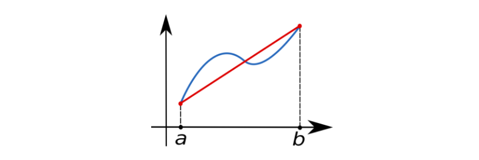
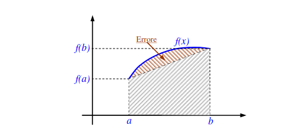

# 6. Integrazione numerica

[TOC]

## Definizione del problema

Sia $f$ la funzione integranda (spesso non lineare, difficile da integrare) si vuole approssimare l'integrale definito in un intervallo $[a,b] \subset \R$ 
$$
I(f) = \int_a^b f(x)df
$$
L'approssimazione prende il nome di quadratura $Q(f)$ dell'integrale $I(f)$
$$
Q_n(f) = \sum_{i=0}^n a_i f(x_i)
$$
Dove: 

- $n$ è il numero di nodi della quadratura
- $a_i$ sono i parametri della quadratura
- $x_i$ sono i nodi della quadratura

I nodi della quadratura sono sempre **ugualmente spaziati**, essendo che tale problema non risente della presenza di oscillazioni. Definiamo **errore di quadratura** la seguente quantità: 
$$
E_n(f) = I(f) - Q_n(f)
$$

## Grado di precisione o ordine polinomiale

Indichiamo con $p_i$ il più semplice polinomio di grado $i$, ovvero $p_i=x^i$. Si definisce grado di precisione o ordine polinomiale della quadratura $Q(f)$ quel numero $m$ tale che:
$$
m \in \N : \begin{cases}
I(p_k) = Q(p_k) & k \le m \\
I(p_k) \ne Q(p_k) & k > m
\end{cases}
$$
Ovvero, l'ordine di quadratura indica fino a quale ordine polinomiale la quadratura sia esattamente uguale all'integrale definito. Si può dimostrare che il grado di precisione è un indice della precisione del metodo di quadratura, quindi più alto è, migliore sarà l'approssimazione. 

## Formule di Newton-Cotes (NC)

Le formule di Newton-Cotes sono delle formule di quadratura interpolatorie, i cui nodi sono tutti fissati ed *ugualmente spaziati*. 

### Formula di quadratura interpolatoria

A prescindere dalle formule di Newton-Cotes, che sono un caso particolare, una formula di quadratura interpolatoria determina una quadratura $Q(f)$ della funzione $f$ nell'intervallo $[a,b]$ nel seguente modo: Si determinano $n+1$ nodi $x_0, x_1, \dots, x_n$ distinti e si pone $y_i = f(x_i)$ (essendo $f$ nota). Dopodiché si calcola il polinomio interpolante $p_n \in P_n$, che è semplice da integrare, e si pone: 
$$
Q(f) = \int_a^b p_n(x)dx
$$
Ogni formula di quadratura interpolatoria che usi $n+1$ nodi ha, per costruzione, grado di precisione almeno $n$. 

### Utilizzare il metodo dei coefficienti indeterminati

Possiamo ricavare le formule di NC ad $n+1$ punti utilizzando il metodo dei coefficienti indeterminati. In generale, con $n+1$ punti costruiamo un polinomio di grado $n$, la cui quadratura avrà grado di precisione almeno $n$ (può essere anche maggiore). Quindi per ottenere i coefficienti, creiamo un sistema lineare in cui imponiamo che quadratura e polinomi semplici coincidano fino al grado $n$. 

> Osservazione: i parametri non dipendono dai nodi, infatti le formule di NC di grado $n$ generico possono essere precalcolate e utilizzate direttamente. Il calcolo può, per l'appunto, essere svolto attraverso il metodo dei coefficienti indeterminati. 

### Regola del trapezio

La formula di NC a 2 punti nell'intervallo $[a,b]$ è detta regola del trapezio. Essendo che i due punti devono essere equispaziati, allora prenderemo $x_0=a, x_1=b$. Il polinomio interpolante sarà di grado 1, quindi sarà una retta. Avremo quindi: 
$$
Q_1(f) = \sum_{i=0}^1 a_i f(x_i) = a_0 f(x_0) + a_1f(x_1) = a_0 f(a) + a_1 f(b) \\
\Longrightarrow Q_1(f) = a_0 f(a) + a_1 f(b)
$$
Dobbiamo determinare i parametri $a_0$ ed $a_1$ e per questo utilizziamo il metodo dei coefficienti indeterminati. Per $n=1$ vogliamo un grado di precisione almeno $m=1$, quindi imponiamo: 
$$
\begin{cases}
Q_1(1) = I(1) \\
Q_1(x) = I(x)
\end{cases}

\hspace{.5cm}
\text{ovvero}
\hspace{.5cm}

\begin{cases}
a_0 + a_1 = \int_a^b dx = b-a \\
a_0 a + a_1 b = \int_a^b x dx = \frac{b^2 - a^2}{2}
\end{cases}
$$
Risolvendo il sistema otteniamo: 
$$
a_0 = a_1 = \frac{b-a}2
$$
Sostituendo $a_0,a_1$ nella formula di quadratura, otteniamo: 
$$
Q_1(f) = a_0 f(a) + a_1 f(b)  = 
\frac{b-a}{2} f(a) +  \frac{b-a}{2} f(b) =
\frac{f(a) + f(b)}{2}(b-a)
$$
Che è proprio la formula dell'area del trapezio:
$$
Q_1(f) = \frac{f(a) + f(b)}{2}(b-a)
$$

#### Errore nella regola del trapezio

Osserviamo la seguente figura: 

Se $f \in C^{n+1}[a,b]$ allora per determinare l'errore su un determinato punto $x\in [a,b]$ possiamo utilizzare la formula dell'errore sull'interpolazione lagrangiana: 
$$
e(x) = f(x)-p_n(x) = \frac{f^{(n+1)}(\xi)}{(n+1)!}W(x)
$$
Per calcolare l'errore di quadratura, quindi l'errore su tutto l'intervallo $[a,b]$, possiamo integrare la precedente espressione: 
$$
E_n(f) = \int_a^b \frac{f^{(n+1)}(\xi)}{(n+1)!}W(x) dx
$$
Nel caso della formula del trapezio abbiamo che $n=1$ e $W(x)=(x-a)(x-b)$ (per costruzione di $W(x)$  e dato che $x_0=a,x_1=b$). L'errore nel trapezio $E_T$ sarà: 
$$
E_T (f) = \frac{1}{2}\int_a^b f''(\xi) (x-a)(x-b)dx
$$
Il **teorema del valor medio** enuncia che, siano due funzioni $g,h \in C[a,b]$ e $g$ non cambia di segno in $[a,b]$, allora esiste un $\eta \in [a,b]$ tale che 
$$
\int_a^b g(x)h(x)dx = h(\eta) \int_a^b g(x)dx
$$
Applicando il teorema all'espressione (13) possiamo far uscire $f''(\xi)$ dall'integrale sotto forma di $f''(\eta)$, essendo che $(x-a)(x-b)$ non cambia di segno. 
$$
E_T (f) = \frac{f''(\eta)}{2} \int_a^b (x-a)(x-b)dx
$$
A questo punto risolviamo l'integrale analiticamente ed otteniamo: 
$$
E_T(f) = -\frac{f''(\eta)}{12}(b-a)^3
$$

### Regola di Simpson

La formula di NC a 3 punti nell'intervallo $[a,b]$​ è detta regola di Simpson. Il polinomio interpolante sarà di grado 2.  Avremo quindi: 
$$
Q_2(f) = \sum_{i=0}^2 a_i f(x_i) = a_0 f(x_0) + a_1f(x_1) + a_2f(x_2)
$$
Secondo le formule di NC i nodi sono equispaziati nell'intervallo $[a,b]$. Per semplicità sia $h$ il punto di mezzo
$$
h = \frac{b-a}2
$$
Rimappiamo l'intervallo da $[a,b]$ a $[-h,h]$ (sono intervalli della stessa dimensione) e come 3 punti selezioneremo $\langle -h, 0, h \rangle$. Sostituiamoli nella formula: 
$$
Q_2(f) = a_0 f(-h) + a_1f(0) + a_2f(h)
$$
Il polinomio interpolante sarà di grado $2$, quindi vogliamo che il grado di precisione sia almeno 2. Utilizziamo il metodo dei coefficienti indeterminati per importo e ricavarci $a_0, a_1, a_2$ di conseguenza: 
$$
\begin{cases}
Q_2(1) = I(1) \\
Q_2(x) = I(x) \\
Q_2(x^2) = I(x^2)
\end{cases}
$$
Iniziamo con $Q_2(1)=I(1)$ 
$$
Q_2(1) = a_0 + a_1 + a_2 = \int_{-h}^h dx = 2h
$$
Poi $Q_2(x) = I(x)$
$$
Q_2(x) = -a_0h +a_2h = h(a_2-a_0) = \int_{-h}^h xdx = \left[\frac{x^2}{2}\right]_{-h}^h 
= \frac{h^2}2 - \frac{h^2}2 =0
$$
Poi $Q_2(x^2) = I(x^2)$
$$
Q_2(x^2) = a_0h^2 + a_2h^2 = \int_{-h}^h x^2dx = \left[\frac{x^3}{3}\right]_{-h}^h 
= \frac{2}{3}h^3
$$
Mettendo a sistema: 
$$
\begin{cases}
a_0 + a_1 + a_2 = 2h \\
-a_0h +a_2h = 0 \\
a_0h^2 + a_2h^2 = \frac{2}{3}h^3
\end{cases}
$$
Risolvendo il sistema otteniamo: 
$$
a_0 = a_2 = \frac h3 \hspace{1cm} a_1 = \frac43 h
$$
Sostituiamo nella formula di quadratura: 
$$
Q_2(f) = \frac h3 \bigg( f(-h) + 4f(0) + f(h) \bigg)
$$
Traslando tutto in $[a,b]$ otteniamo: 
$$
Q_2(f) = \frac {b-a}6 \bigg( f(a) + 4f(\frac{b-a}{2}) + f(b) \bigg)
$$
Anche se viene imposto il grado di precisione almeno 2 durante la costruzione, il **reale grado di precisione** della regola di Simpson è 3 (provare per credere). 

#### Errore nella regola di Simpson

Facendo esattamente gli stessi passi svolti per l'errore nella regola del trapezio, ma ponendo $n=2$ e $W(x) = (x-x_0)(x - x_1)(x-x_2)$ otteniamo l'errore $E_S$ nella regola di Simpson:
$$
E_S (f) = \frac{1}{6}\int_a^b f^{(IV)}(\xi) (x-x_0)(x - x_1)(x-x_2)dx
$$
Il prodotto $W(x)=(x-x_0)(x - x_1)(x-x_2)$ potrebbe cambiare di segno, quindi non possiamo sfruttare il teorema del punto medio. Se ognuno dei fattori $(x - x_i)$ avesse un segno definito, anche $W(x)$ lo avrebbe. 

Ricorriamo allo studio dell'errore sull'interpolazione hermitiana. Nel capitolo precedente abbiamo visto che se si conosce fino alla derivata $n$-esima del nodo $x_i$, allora il termine $(x-x_i)$ in $W(x)$ nel calcolo dell'errore doveva essere elevato ad $(n+1)$: $(x -  x_i)^{n+1}$.  

Esclusivamente a scopo di calcolare l'errore, anziché calcolare $p_2 \in P_2$ andremo a calcolare $p_3 \in P_3$ poiché aggiungeremo l'ulteriore condizione sulla derivata nel punto medio: 
$$
p_3'\left(\frac{a+b}{2}\right) = f'\left(\frac{a+b}{2}\right)
$$

Quindi avremo $W(x)=(x-x_0)(x-x_1)^2(x-x_2)$ e modificheremo l'errore come segue:
$$
E_S (f) = \frac{1}{6}\int_a^b f^{(IV)}(\xi) (x-x_0)(x - x_1)^2(x-x_2)dx
$$
$W(x)$ adesso ha segno costante, quindi possiamo quindi utilizzare il teorema del punto medio e ottenere: 
$$
E_S (f) = \frac{f^{(IV)}(\eta)}{6}\int_a^b (x-x_0)(x - x_1)^2(x-x_2)dx
$$
e risolvendo analiticamente l'integrale:
$$
E_S (f) = - \frac{f^{(IV)}(\eta)}{90}\left( \frac{b-a}{2} \right)^5
$$

### Grado di precisione ed errore nelle formule NC

Ricavando una formula di quadratura attraverso le formule di NC, vale che il grado di precisione $m$ è strettamente legato ad $n$ (grado del polinomio) ed in particolare:

- Se $n$ è pari, $m=n$
- Se $n$ è dispari, $m=n+1$

Si può dimostrare che, se $h$ è la distanza tra un nodo e l'altro ed $n+1$ è il numero di nodi, allora l'errore 
$$
err \propto h^{2n+1}
$$
Per questo non conviene andare oltre $n=2$. Per ottenere formule più accurate si utilizzano due tecniche: 

- Quadrature gaussiane
- Divisione in sotto-intervalli, ovvero quadrature composte.

## Quadrature composte

L'idea è quella di dividere $[a,b]$​ in sotto-intervalli e di utilizzare una formula di Newton-Cotes per integrare ogni sotto-intervallo. Il numero di sotto-intervalli dipende da che tolleranza dell'errore impostiamo.  Sia $N$ il numero di sotto-intervalli in cui si divide $[a,b]$, allora: 
$$
Q_n(f) = \sum_{i=0}^{N-1} \int_{x_i}^{x_{i+1}} f(x)dx
$$

### Quadratura composta con regola del trapezio

Se si decide di utilizzare la regola del trapezio, allora la quadratura sarà:
$$
Q_n(f) = \sum_{i=0}^{N-1} \bigg[ Q_1(f) + E_T(f) \bigg]_{x_i}^{x_{i+1}}
$$
Notiamo che, una volta conosciuto l'errore di quadratura, possiamo andare a sommarlo per ottenere una quadratura più precisa. Apice e pedice nella parentesi quadra indicano che la quadratura viene svolta nel sotto-intervallo $[x_i, x_{i+1}]$. Andiamo a sostituire le espressioni: 
$$
Q_n(f) = \sum_{i=0}^{N-1}\left(
\frac{f(x_i) + f(x_{i+1})}{2}(x_{i+1} - x_i) 
- \frac{f''(\eta_i)}{12}(x_{i+1} - x_i)^3
\right)
$$
Data la divisione degli intervalli, avremo che $a=x_0, b=x_N$. Supponiamo per semplicità che i nodi siano ugualmente spaziati, allora la lunghezza di ogni singolo sotto-intervallo è: 
$$
h = \frac{b-a}N
$$
Sostituiamo $h$ nella formula: 
$$
Q_n(f) = \sum_{i=0}^{N-1}\left(
\frac{f(x_i) + f(x_{i+1})}{2}h 
- \frac{f''(\eta_i)}{12}h^3
\right)
$$
Che per la proprietà di linearità delle sommatorie può essere riscritta come: 
$$
Q_n(f) = \frac h2 \sum_{i=0}^{N-1}\bigg[ f(x_i) + f(x_{i+1} \bigg]
-\sum_{i=0}^{N-1} \left(\frac{f''(\eta_i)}{12}h^3\right)
$$
Concentriamoci sulla prima sommatoria:
$$
\begin{split}
\sum_{i=0}^{N-1} \bigg[ f(x_i) + f(x_{i+1} \bigg] &= 
\bigg[ f(x_1) + f(x_2) \bigg] + \bigg[ f(x_2) + f(x_3) \bigg] + \dots +
\bigg[ f(x_{n-1}) + f(x_n) \bigg] \\
&=f(x_1)+f(x_n)+ 2\sum_{i=1}^{N-1} f(x_i)
\end{split}
$$
Sostituendo all'espressione precedente:
$$
Q_n(f) = \frac h2 \bigg[ f(x_1)+f(x_n) \bigg]+ h\sum_{i=1}^{N-1} f(x_i) 
-\sum_{i=0}^{N-1} \left(\frac{f''(\eta_i)}{12}h^3\right)
$$
Dato che non sappiamo valutare gli $\eta_i$ nella formula dell'errore, possiamo utilizzare il **lemma del valor medio applicato alle sommatorie**, che enuncia: 
$$
a_0, \dots, a_{n-1} \in \R : sign(a_0) = \dots = sign(a_{n-1}), \\
g\in C[a,b] \\
x_0, \dots, x_{n-1} \in \R \\
\Longrightarrow \\
\exist \eta \in [a,b] : \sum_{i=0}^{n-1} a_i g(x_i) = g(\eta)\sum_{i=0}^{n-1}a_i
$$
Identificando $f''(\eta)$ con $g(x)$ e $a_j=-\frac{h^3}{12}$ ed applicando il teorema, si ha: 
$$
E_{TC}(f) = - f''(\eta) \sum_{i=0}^{N-1} \frac{h^3}{12} = - f''(\eta) \frac{h^2}{12} \sum_{i=0}^{N-1} h = -f''(\eta) \frac{b-a}{12}h^2
$$
Dove nella sommatoria si lascia un solo termine $h$, che sommato $N-1$ volte ricostruisce la dimensione dell'intervallo $[a,b]$ che è $b-a$. Quindi l'errore sarà
$$
E_{TC}(f) = -f''(\eta) \frac{b-a}{12}h^2
$$
Sostituiamo $h = (b-a)/N$ ed otteniamo:
$$
E_{TC}(f) = -f''(\eta) \frac{(b-a)^3}{12N^2}
$$
Sostituiamolo all'espressione principale della quadratura (43):
$$
Q_n(f) = \frac h2 \bigg[ f(x_1)+f(x_n) \bigg]+ h\sum_{i=1}^{N-1} f(x_i) 
 -f''(\eta) \frac{(b-a)^3}{12N^2}
$$

### Calcolare il numero di sotto-intervalli nel Trapezio composto

Dalla regola dell'errore nel caso della formula del trapezio composto: 
$$
E_{TC}(f) = -f''(\eta) \frac{(b-a)^3}{12N^2}
$$
Ricaviamoci $N$:
$$
N = \sqrt{\frac{(b-a)^3 f''(\eta)}{12 E_{TC}(f)}}
$$
Non conosciamo $f''(\eta)$ ma possiamo studiare un upper bound calcolando il massimo  $\|f''\|_{\infty}$ di $f''$, quindi fissato una certa tolleranza $\epsilon$, affinché la quadratura composta dei trapezi rispetti tale tolleranza bisogna selezionare $N$ tale che: 
$$
N \ge \sqrt{\frac{(b-a)^3 \|f''\|_{\infty}}{12 \epsilon}}
$$

### Calcolare il numero di sotto-intervalli nel Simpson composto

Dato l'errore calcolato sulla regola di Simpson:
$$
E_S (f) = - \frac{f^{(IV)}(\eta)}{90}\frac{b-a}{2}^5
$$
Trasformiamolo nell'errore della formula composta di Simpson: 
$$
\begin{split}
E_{SC} (f) &=- \sum_{i=0}^{N-1} \frac{f^{(IV)}(\eta)}{90}\left(\frac{h}{2}\right)^5=\\
&= - f^{(IV)}(\eta) \sum_{i=0}^{N-1} \frac{h^5}{2880} = \\
&= - f^{(IV)}(\eta) \frac{h^4}{2880} \sum_{i=0}^{N-1} h = \\
&= - f^{(IV)}(\eta) \frac{h^4}{2880} (b-a)= \\
&= - f^{(IV)}(\eta) \frac{(b-a)^4}{2880 N^4} (b-a)= \\ 
&= - f^{(IV)}(\eta) \frac{(b-a)^5}{2880 N^4}
\end{split}
$$
Anche qui possiamo ricavare $N$: 
$$
N = \root{4}\of{\frac{f^{(IV)}(\eta) (b-a)^5 }{2880 E_{TC}(f)}}
$$
Impostando una tolleranza $\epsilon$ e utilizzando il massimo di $\|f^{(IV)}\|_{max}$ dobbiamo selezionare:
$$
N \ge \root{4}\of{\frac{\|f^{(IV)}\|_{max} (b-a)^5 }{2880 \epsilon }}
$$

## Teorema di convergenza di una generica quadratura

Sia $f \in C[a,b]$ e sia $Q_n(f)$ una quadratura di grado $n$ dell'integrale $I(f)$ nell'intervallo $[a,b]$, se vale che 
$$
\exist k >0: \sum_{i=0}^n |a_i| \le k \Longrightarrow
\lim_{n \to \infty} Q_n(f) = I(f)
$$

> Le formule di NC non rispettano tale teorema poiché all'aumentare del grado, la grandezza dei parametri $a_i$ cresce. 

## Formule Gaussiane

Le formule di quadratura gaussiane sono costruite prendendo come incognite sia i nodi $x_i$ che i parametri $a_i$. Le incognite saranno in totale $2n+2$ ed il loro grado di precisione sarà $m=2n+1$. Il sistema che si dovrà risolvere sarà non lineare, ma utilizzeremo dei metodi per raggirare il problema. 

### Mid-point rule

Mid-point rule è il nome attribuito alla formula gaussiana $Q_0(f)$ di grado di precisione $m=1$, ottenuto prendendo un solo punto, quindi $n=0$, di conseguenza $m=2n+1=1$. Utilizzando la definizione di formula di quadratura avremo: 
$$
Q_0(f) = a_0f(x_0)
$$
Come fatto per le formule di Newton-Cotes, andiamo ad imporre che: 
$$
\begin{cases}
Q_0(1) = I(1) \\
Q_0(x) = I(x)
\end{cases}

\hspace{.5cm}
\text{ovvero}
\hspace{.5cm}

\begin{cases}
a_0 = b-a \\
a_0x_0 = \frac{b^2 - a^2}{2}
\end{cases}
$$

> I calcoli degli integrali dei polinomi semplici li abbiamo già fatti prima. Vedasi regola del trapezio.

Da cui otteniamo: 
$$
a_0 = b-a \hspace{1cm} x_0 = \frac{b+a}2
$$
Osserviamo che $x_0$ è pari al punto medio dell'intervallo $[a,b]$. Quindi sostituendo nella formula di quadratura abbiamo: 
$$
Q_0(f) = (b-a) f\left(\frac{b-a}{2}\right)
$$
L'interpretazione geometrica è la seguente:

#### Errore nella mid-point rule

Il procedimento per ricavare l'errore è lo stesso visto nelle formule di NC, in tal caso l'errore vale:
$$
E_{MR}(f) = \frac{b-a}{2h} f''(\eta)
$$
Dove $h$ è il midpoint. 

### Formula Gaussiana $Q_1(f)$

Per $n=1$ le incognite sono 4: $a_0, a_1, x_0, x_1$. L'ordine della formula è $m=2n+1=3$. Sviluppiamo la formula: 
$$
Q_1(f) = a_0 f(x_0) + a_1 f(x_1)
$$
Per semplicità, poniamo $[a,b] = [-1,1]$. Imponiamo che il grado di precisione sia 3:
$$
\begin{cases}
Q_1(1) = I(1) \\
Q_1(x) = I(x) \\
Q_1(x^2) = I(x^2) \\
Q_1(x^3) = I(x^3)
\end{cases}
$$
Ricordando di aver cambiato l'intervallo, ricaviamo il sistema: 
$$
\begin{cases}
a_0 + a_1 = 2 \\
a_0 x_0 + a_1 x_1 = 0 \\
a_0 x_0^2 + a_1 x_1^2 = 2/3 \\
a_0 x_0^3 + a_1 x_1^3 = 0
\end{cases}
$$
Risolvendo il sistema otteniamo: 
$$
a_0=a_1=1 \hspace{1cm}
x_0 = -\frac{\sqrt{3}}{3} \hspace{1cm}
x_1 = \frac{\sqrt{3}}{3}
$$
Andiamo a sostituire nella formula ed otteniamo: 
$$
Q_1(f) = f\left(-\frac{\sqrt{3}}{3}\right) + f\left(\frac{\sqrt{3}}{3}\right)
$$
Adesso possiamo rimappare sia i nodi che i parametri nell'intervallo $[a,b]$ attraverso la formula: 
$$
x_{new} = \frac{b-a}{2}x_{old} + \frac{b+a}{2}
$$
Otterremo quindi la formula: 
$$
Q_1(f) = \frac{b-a}2 \left[
f\left( \frac{a+b}{2} -\frac{b-a}{2\sqrt{3}} \right) + 
f\left( \frac{a+b}{2} +\frac{b-a}{2\sqrt{3}} \right)
\right]
$$

### Teorema (nodi come zeri di un polinomio ortogonale) 

Se $Q_n(f)$ è una formula di quadratura gaussiana e se i nodi $x_i$ sono gli zeri di un polinomio $p_{n+1} \in \Pi_{n+1}$ (quindi ortogonale su $[a,b]$) allora il grado di precisione della formula di quadratura è pari a $2n+1$.

#### Scorciatoia per il calcolo delle formule gaussiane

Per il teorema precedente, anziché considerare i nodi come incognite, possiamo utilizzare come nodi gli zeri di una classe di polinomi ortogonali, come i polinomi di Chebichev. Nel caso della formula gaussiana $Q_1(f)$ non sarebbe necessario risolvere il sistema non lineare!

