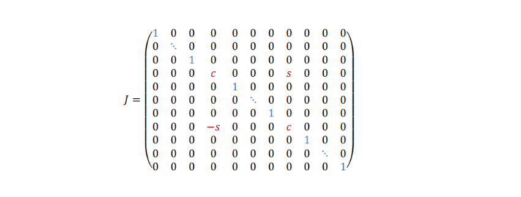
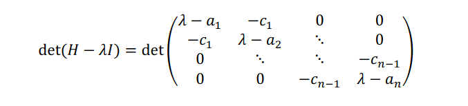

# 7. Autovalori

[TOC]

## Definizione del problema

Sia $A \in R^{n \times n}$, si definisce $\lambda \in \C$ un autovalore di $A$ se $\exist v \in \R^n$ autovettore non nullo tale che
$$
Av = \lambda v
$$
Data una matrice $A$ il problema può porsi diversi obiettivi: 

* Trovare tutte le autocoppie
* Trovare solo gli autovalori
* Trovare l'autovalore più grande / più piccolo

## Richiami alle caratteristiche

Richiamiamo alcune caratteristiche degli autovalori, già esposte nel capitolo sulle matrici:

- Un autovettore è sempre diverso dal vettore nullo
- Un autovalore può essere nullo
- Se $\lambda_1, \lambda_2 \in \sigma(A)$ allora essi possono essere:
  - Reali e distinti
  - Reali e coincidenti
  - Complessi coniugati
- Se è presente un autovalore complesso, sarà presente anche il coniugato
- Gli autovalori di una matrice $n\times n$ sono al più $n$ 
- Gli autovettori sono invece infiniti: $Av = \lambda v \to A\alpha v = \lambda \alpha v, \forall \alpha \in \R$ 
- Gli autovalori linearmente indipendenti sono al più $n$ e formano un autospazio

## Strategia numerica per il calcolo degli autovalori

La strategia numerica per il calcolo degli autovalori è differente rispetto a quella analitica, che consiste nel risolvere l'equazione caratteristica della matrice. 

La strategia numerica consiste nel calcolare una matrice triangolare $C$ che sia simile ad $A$. Questo poiché:

1. Vale il teorema di Shur ([vedasi capitolo 2 - matrici](./Ch_2_richiami_sulle_matrici.md))
2. Matrici simili hanno gli stessi autovalori
3. Gli autovalori di una matrice triangolare risiedono sulla diagonale principale

Spesso è complesso trovare $C$ triangolare, per cui un trade-off tra complessità dell'algoritmo e risoluzione del problema è quello di trovare $C$ come **matrice di Hessemberg**. La soluzione in tali matrici non è immediata, ma è più semplice rispetto al problema principale. 

## Condizionamento nel problema degli autovalori

Il condizionamento nel problema degli autovalori è differente rispetto a quello nei sistemi lineari. La matrice di Hilbert risulta mal condizionata per sistemi lineari, ben condizionata per gli autovalori. Si supponga che $A$ sia diagonalizzabile e sia $D$ la matrice diagonale ad essa simile: 
$$
D = P^{-1}AP
$$
Sia la norma matriciale di $D$ pari all'autovalore principale di $A$: 
$$
\|D\| = \max |d_i| = \max |\lambda_i|
$$
Vale il seguente teorema: 

### Teorema di Bauer-Fike

Sotto le precedenti condizioni, sia $E$ una matrice di perturbazione per $A$ e sia $(A+E)$ la matrice perturbata, sia inoltre $\lambda \in \sigma(A+E)$ e siano $\lambda_i \in \sigma(A)$ per $i=1,\dots,n$. Allora:
$$
\min_{\lambda_i \in \sigma(A)} |\lambda - \lambda_i| \le 
\|P\| \cdot \|P^{-1}\| \cdot \|E\|
$$

> La distanza più piccola credo serva ad identificare l'autovalore $\lambda_i$ in $A$ corrispondente a $\lambda$ in $(A+E)$. Il teorema ci dice che l'errore è più piccolo dello scalare a destra. 

Se $A$ è una matrice normale, $AA^T = A^T A$, allora la matrice $P$ può essere scelta unitaria, e in tale caso si dimostra analiticamente che
$$
\|P\| = \|P^{-1}\|= 1
$$
E quindi la tesi del teorema sarà:
$$
\min_{\lambda_i \in \sigma(A)} |\lambda - \lambda_i| \le \|E\|
$$

### Numero di condizionamento

Sia $P$ la matrice di trasformazione $A$ tale che $D=P^{-1}AP$, allora il numero di condizionamento $k(A)$ di $A$ sarà: 
$$
k(A) = \|P\| \cdot \|P^{-1}\|
$$
Il miglior condizionamento nel problema degli autovalori si ha quando la matrice di trasformazione $P$ è unitaria / ortogonale: 
$$
k(A) = \|P\| \cdot \|P^{-1}\| = 1
$$

## Risultati di impossibilità: Teorema di Abel

La necessita dell'utilizzo di metodi iterativi può essere giustificata dalla difficoltà nel risolvere equazioni polinomiali di alto grado (nel caso degli autovalori, la risoluzione analitica necessita della risoluzione dell'equazione caratteristica, il cui grado è $n$ la dimensione della matrice). Il teorema di Abel dimostra la non esistenza di formule dirette per il calcolo degli zeri di un polinomio di grado maggiore o uguale al quinto. 

## Metodo delle potenze

> Nota: se si vuole ricavare tutto lo spettro attraverso il metodo delle potenze, si veda il metodo della deflazione.

Il metodo delle potenze è un metodo iterativo che calcola l'autovalore principale $\lambda_1$. Si supponga che $A$ sia diagonalizzabile, un teorema enuncia che $A$ è diagonalizzabile se e solo se possiede $n$ autovettori linearmente indipendenti. Siano $u_1, \dots, u_n$ tali autovettori. 

Il metodo parte da $x_0 \in \R$ casuale. Consideriamo $x_0$ come combinazione lineare degli autovettori: 
$$
x_0 = \alpha_1 u_1 + \dots + \alpha_n u_n
$$
Ricordiamo la proprietà delle autocoppie che per $k \in \N$ si ha: 
$$
A^k u= \lambda^k u
$$
Poniamo $x_1 = A x_0$, e analogamente $x_2 = A x_1 = A^2x_0$. In generale avremo che: 
$$
x_k = A^k x_0
$$
Ora andiamo a sostituire $x_0$ nell'espressione precedente con la combinazione lineare degli autovettori: 
$$
\begin{split}
x_k &= A^k (\alpha_1 u_1 + \dots + \alpha_n u_n) \\
&= \alpha_1A^k u_1 + \dots + \alpha_nA^k u_n \\
&= \alpha_1 \lambda_1^k u_1 + \dots + \alpha_n \lambda_n^k u_n \\

\end{split}
$$
Nei passaggi abbiamo applicati alcune proprietà fondamentali degli autovalori. Adesso raccogliamo per $\alpha_1 \lambda_1^k$
$$
x_k = \alpha_1 \lambda_1^k \left[
u_1 + 
\frac{\alpha_2}{\alpha_1}\left( \frac{\lambda_2}{\lambda_1} \right)^k u_2 
+ \dots +
\frac{\alpha_n}{\alpha_1}\left( \frac{\lambda_n}{\lambda_1} \right)^k u_n
\right]
$$
A questo punto normalizziamo il vettore dividendo per $\alpha_1 \lambda^k_1$
$$
\bar{x}_k = \frac{x_k}{\alpha_1 \lambda_1^k} =
u_1 + 
\frac{\alpha_2}{\alpha_1}\left( \frac{\lambda_2}{\lambda_1} \right)^k u_2 
+ \dots +
\frac{\alpha_n}{\alpha_1}\left( \frac{\lambda_n}{\lambda_1} \right)^k u_n
= 
u_1 + \sum_{i=1}^n \frac{\alpha_i}{\alpha_1}\left( \frac{\lambda_i}{\lambda_1} \right)^k u_i
$$
Adesso studiamo il limite per $k \to +\infty$ 
$$
\lim_{k \to +\infty} x_k = 
\lim_{k \to +\infty} \left[ u_1 + \sum_{i=1}^n \frac{\alpha_i}{\alpha_1}\left( \frac{\lambda_i}{\lambda_1} \right)^k u_i \right]
$$
Dato che $\lambda_1$ è la componente principale, ed è più grande in modulo rispetto agli altri autovalori, allora il rapporto $\lambda_i / \lambda_1$ tenderà a 0 per $k \to +\infty$. Questo implica che il limite tenderà a $u_1$
$$
\lim_{k \to +\infty} x_k =  u_1
$$
In generale, il passo di aggiornamento è: 
$$
x_{k+1} = A x_k
$$
Quindi possiamo osservare che: 
$$
\lim_{k \to +\infty} x_k  = u_1 \Longrightarrow 
\lim_{k \to +\infty} x_{k+1} = \lim_{k \to +\infty} Ax_k = A u_1
$$
Per definizione di autovalore e autovettore abbiamo:
$$
\lim_{k \to +\infty} x_{k+1} = A u_1 = \lambda_1 u_1
$$

### Coefficiente di Rayleigh 

Per estrarre la componente principale $\lambda_1$ bisogna utilizzare il coefficiente di Rayleigh, definito come segue: 
$$
\beta_k = \frac{\bar x_k^T \cdot \bar x_{k+1}}{\| \bar x_k \|_2^2}
$$
Dato che $\bar x_k \to u_1$ e $\bar x_{k+1} \to \lambda_1 u_1$ allora possiamo dire che per $k \to +\infty$ il coefficiente 
$$
\beta_k \to \frac{u_1^T u_1}{\|u_1\|_2^2}\lambda_1 = 
\frac{u_1^T u_1}{u_1^T u_1} \lambda_1 = \lambda _1
$$
Per evitare problemi di underflow / overflow, si normalizzano i vettori ad ogni iterazione in modo che la loro norma sia unitaria. 

### Casistiche per più componenti principali

Nei casi pratici potrebbe capitare di trovare più autovalori principali, ovvero che più autovalori detengano magnitudo massima. Vediamo i vari casi: 

- $\lambda_2 = \lambda_1$ il metodo è ancora convergente
- $\lambda_2 = -\lambda_1$ il metodo viene applicato su $A^2$ (poiché $\lambda_2^2 = \lambda_1^2$)
- $\lambda_2 = \bar\lambda_1$ se sono complessi coniugati il metodo diverge.

## Trasformazioni per similarità 

I metodi che calcolano l'intero spettro $\sigma$ di una matrice sfruttano trasformazioni per similarità, ovvero si avvalgono del teorema di Shur e cercano di trovare una matrice di Hessemberg simile alla matrice del problema, per poi determinare più semplicemente l'analogo spettro.

### Metodo di fattorizzazione QR

Il metodo torna in output una matrice $T_k$ triangolare e simile alla matrice $A$ di partenza. Ha una complessità computazionale di circa $n^4$ flops. 

L'idea principale è la seguente: sia $A \in \R^{n \times n}$ e sia $Q_0$ una matrice ortogonale, quindi ($Q_0^TQ_0 = Q_0Q_0^T = I$), si ponga per definizione: 
$$
T_0 = Q_0^T A Q_0
$$
Si dia per assunto che esista un metodo di fattorizzazione QR che riesca a fattorizzare: 
$$
Q_1 R_1 = T_0
$$
  Invertendo l'ordine della fattorizzazione calcoliamo $T_1$
$$
T_1 = R_1 Q_1
$$
In generale si ha: 
$$
\begin{cases}
Q_k R_k = T_{k-1} \\
T_k = R_k Q_k
\end{cases}
$$
Ricordando che $Q_k$ è ortogonale, quindi $Q_k^T Q_k = I$. Adesso osserviamo: 
$$
\begin{split}
T_k &= R_k Q_k \\
&= Q_k^T Q_k R_k Q_k \\
&= Q_k^T T_{k-1} Q_k \\
&= Q_k^T Q_{k-1}^T \dots Q_{0}^T A Q_0\dots Q_{k-1}Q_k \\
&= (Q_0\dots Q_{k-1}Q_k)^T A (Q_0\dots Q_{k-1}Q_k)
\end{split}
$$
Osserviamo che $T_k$ è ortogonalmente simile a $T_{k-1}$ dato che $T_k= Q_k^T T_{k-1} Q_k$ e $Q_k$ è una matrice ortogonale. Ripetendo i passaggi $T_k$ è ortogonalmente simile ad $A$. Nel caso in cui $A$ abbia **autovalori reali e distinti**, allora $T_k$ tende a diventare una matrice **triangolare superiore**. Nella formulazione più basilare si ha $Q_0 = I$ quindi $T_0 = A$ e la fattorizzazione è ottenuta tramite il metodo di ortogonalizzazione di Gram-Schmidt, quindi il costo di ogni passo è $n^3$. 

Anziché procedere come visto, possiamo utilizzare dei metodi che riducono la matrice iniziale ad una matrice di Hessemberg. Il costo di ogni passo per la fattorizzazione scende da $n^3$ ad $n^2$. Vedremo principalmente due metodi: Householder e Givens.

### Metodo di Householder

> Ottimo per matrici piene, non per matrici sparse. 

Si basa sull'idea di annullare ogni colonna sotto la sub-diagonale, caricando il peso sull'elemento della sub-diagonale. Il metodo si applica $n-1$ volte alla matrice di partenza. Supponiamo di trovarci al passo $i$ e identifichiamo la colonna $i$-esima attraverso il vettore $x$: 
$$
x = \begin{bmatrix}
x_1 & x_2 & \dots & 
x_{n-q} & x_{n-q+1} & \dots &
x_n
\end{bmatrix}^T
$$
Dove $q$ identifica il numero di elementi sotto la diagonale principale (compreso l'elemento della diagonale principale), quindi: 

* $x_{n-q}$ è l'elemento nella diagonale principale
* $x_{n-q+1}$ è l'elemento nella sub-diagonale principale, che dovrà farsi carico degli elementi cancellati

Il vettore dovrà essere trasformato come segue: 
$$
x = \begin{bmatrix}
x_1 \\ x_2 \\ \vdots \\ 
x_{n-q} \\ x_{n-q+1} \\  x_{n-q+2} \\ \vdots \\
x_n
\end{bmatrix}
\to Px = 
\begin{bmatrix}
x_1 \\ x_2 \\ \vdots \\ 
x_{n-q} \\ \bar x_{n-q+1} \\  0 \\ \vdots \\
0
\end{bmatrix}
$$
Per far rimanere invariata la porzione $[x_1, \dots, x_{n-q}]$ del vettore, possiamo semplicemente porre la matrice di trasformazione come: 
$$
P = \begin{bmatrix}
I & 0 \\
0 & \tilde{P}
\end{bmatrix}
$$
Per far corrispondere tutto, le dimensioni sono $I \in \R^{n-q}$ e $\tilde{P} \in \R^{q}$, che è l'effettivo operatore che effettua l'eliminazione degli elementi e la trasformazione $x_{n-q+1} \to \bar x_{n-q+1}$, e che prende il nome di **matrice di Householder**. Spieghiamo come costruire $\tilde{P}$ con un esempio. 

#### Esempio: Costruzione matrice di Householder

Sia $x$ la porzione di interesse (da $n-1+1$ in poi) del vettore colonna da annullare:
$$
x = \begin{bmatrix} 2 & -2 & 1 \end{bmatrix}^T
$$
La matrice di Householder vale:
$$
\tilde P = I - 2 \frac{v^Tv}{v^T v}
$$
Dove il vettore $v$, derivato da una lunga serie di calcoli, è definito come segue: 
$$
v = x \pm \|x\|_2 \cdot e_1
$$
Dove $e_1 = \begin{bmatrix} 1 & 0 & 0 \end{bmatrix}$ è sempre il primo vettore della base canonica di $\R^q$. Si sceglie solitamente la norma a **segno positivo**. Procediamo: 
$$
v = x + \|x\|_2 \cdot e_1 = 
\begin{bmatrix}
2 \\ -2 \\ 1
\end{bmatrix}
+ 3
\begin{bmatrix}
1 \\ 0 \\ 0
\end{bmatrix}
= 
\begin{bmatrix}
5 \\ -2 \\ 1
\end{bmatrix}
$$
Sostituiamo $v$ nella definizione di $\bar P$ e calcoliamola: 
$$
\tilde P = I - 2 \frac{v^Tv}{v^T v} = 
\begin{bmatrix}
1 & 0 & 0 \\
0 & 1 & 0 \\
0 & 0 & 1
\end{bmatrix}
- \frac{2}{30} 
\begin{bmatrix}
25 & -10 & 5 \\
-10 & 4 & -2 \\
5 & -2 & 1
\end{bmatrix} =
\begin{bmatrix}
-\frac{2}{3} & \frac{2}{3} & -\frac{1}{3} \\
\frac{2}{3} & \frac{11}{15} & \frac{2}{15} \\
-\frac{1}{3} & \frac{2}{15} & \frac{14}{15}
\end{bmatrix}
$$
Si osservi che la matrice $\tilde{P}$ di Householder è una matrice **simmetrica ortogonale**. Eseguiamo la verifica andando a calcolare $\bar x = Px$
$$
\bar x = \tilde{P}x =
\begin{bmatrix}
-\frac{2}{3} & \frac{2}{3} & -\frac{1}{3} \\
\frac{2}{3} & \frac{11}{15} & \frac{2}{15} \\
-\frac{1}{3} & \frac{2}{15} & \frac{14}{15}
\end{bmatrix}
\begin{bmatrix}
2 \\ -2 \\ 1
\end{bmatrix} =
\begin{bmatrix}
-3 \\ 0 \\ 0
\end{bmatrix}
$$
Il vettore si attacca alla parte della subdiagonale della colonna esaminata, dopodiché si passa alla colonna successiva. 

### Metodo di Givens

> Ottimo per matrici sparse. 

Il metodo di Givens ha lo stesso scopo del metodo di Householder, quindi per ogni colonna (eccetto l'ultima) elimina tutti gli elementi sotto la subdiagonale, caricando tutto sull'elemento della subdiagonale. La differenza è che anziché calcolare $\tilde P$ per eliminare direttamente tali elementi, calcola una matrice $J$ per ognuno degli elementi da annullare. Il calcolo di $J$ è più semplice di $\tilde P$ e se la matrice è sparsa il metodo conviene. Vediamo come costruire tale matrice. 

> Altra differenza: la matrice di Householder è definita come una matrice di traslazione, mentre quella di Givens come una matrice di rotazione. 

#### Costruzione matrice di Givens 

Fissata la $i$-esima colonna su cui si sta lavorando, consideriamo il vettore $x$ come la porzione di interesse di tale colonna, ovvero dalla subdiagonale in giù. Adesso: 

- Si vuole annullare l'elemento $x_k \in x$ 
- L'elemento subdiagonale $x_i \in x$ prenderà carico dell'annullamento. 

Si costruisce $J(i,k,\theta)$ (dove $\theta$ è un angolo di rotazione che non dovremo determinare) come segue:

La matrice è essenzialmente una matrice identità $I_q$ con i seguenti elementi modificati: 
$$
J_{ii} = c \hspace{1cm} 
J_{kk} = c \hspace{1cm}
J_{ik} = s \hspace{1cm}
J_{ki} = -s
$$
Dove: 
$$
c = \cos(\theta) \hspace{1.5cm} s = \sin(\theta)
$$
Anche se non andremo a lavorare con $\theta$, bensì imposteremo $c,s$ in modo che valga l'identità fondamentale della trigonometria: 
$$
\sin^2(\theta) + \cos^2(\theta) = 1 \to c^2 + s^2 = 1
$$
Ed imposteremo $c,s$ affinché venga rispettata la seguente condizione di interesse: 
$$
x = \begin{bmatrix}
x_1 \\ \vdots \\ x_k \\ \vdots 
\end{bmatrix}
\to Jx = 
x = \begin{bmatrix}
x_1 \\ \vdots \\ 0 \\ \vdots 
\end{bmatrix}
$$
Si può dimostrare che impostando nel seguente modo $s,c$ vengono rispettate entrambe le condizioni:<
$$
c = \frac{x_i}{\sqrt{x_i^2 + x_k^2}} \hspace{2cm}
s = \frac{x_k}{\sqrt{x_i^2 + x_k^2}}
$$
Una volta formata la matrice $J$, si procede ad annullare l'elemento in $\bar x = J x$. Si può osservare che la matrice $J$ di Givens è **ortogonale** (ma non simmetrica, come quella di Householder).

### Autovalori in una matrice di Hessemberg

I metodi precedenti restituiscono una matrice di Hessemberg simile alla matrice originale. Per calcolare i suoi autovalori bisogna distinguere due scenari:

- caso in cui $H$ è simmetrica, quindi una matrice tridiagonale 
- caso in cui $H$ è asimmetrica

In generale, ottenuto il polinomio caratteristico è sempre necessario un metodo per trovare gli zeri di una equazione non lineare, che vedremo nel prossimo capitolo. 

#### Matrice di Hessemberg simmetrica

Nel caso in cui la matrice di Hessemberg $H$ è simmetrica, quindi una matrice tridiagonale:

il polinomio caratteristico viene determinato ricorsivamente. Sia $p_i(\lambda)$ il polinomio caratteristico del minore principale $i$-esimo della matrice $H$, allora: 
$$
\begin{cases}
p_0(\lambda) = 1 \\
p_1(\lambda) = \lambda - a_1 \\
p_i(\lambda) = p_{i-1}(\lambda)(\lambda - a_i) - p_{i-2}(\lambda) c_{i-1}^2
\end{cases}
$$

