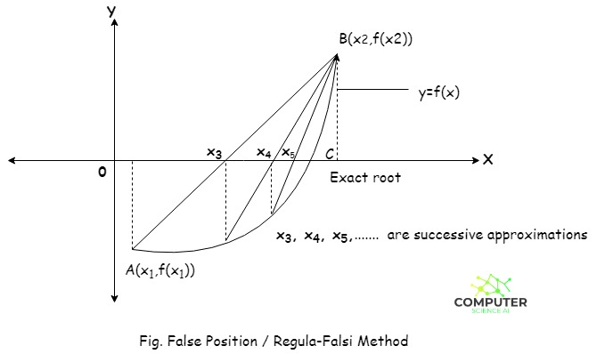
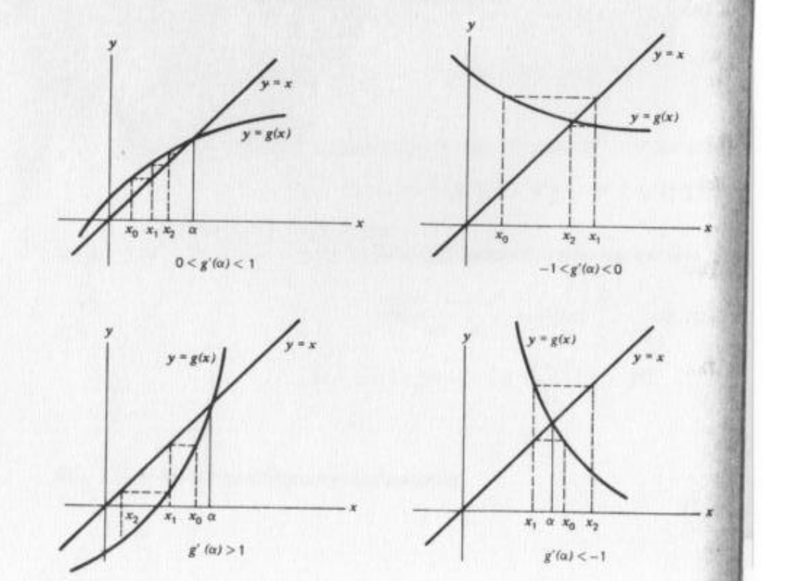

# 8. Zeri di equazioni non lineari

[TOC]

## Definizione del problema

Data $f: (a,b) \to \R$ si affronta il problema di determinare eventuali $\alpha \in (a,b)$ tali che $f(\alpha)=0$. Per evitare che l'algoritmo oscilli tra una soluzione e l'altra, si restringe la ricerca in sottointervalli in cui è presente un solo zero. Partendo da una guess iniziale, l'algoritmo iterativo genera una successione di soluzioni che (si spera) convergano alla soluzione reale.  I metodi possono essere chiusi (bracketing methods), ovvero si richiede un intervallo su cui cercare la soluzione, oppure aperti, che possono divergere ma sono generalmente più veloci. 

### Ordine di convergenza 

Un metodo si dice di ordine $p$ se, detta $\alpha$ la radice ed $\{x_n\}$ la successione di soluzioni, si ha: 
$$
|x_{n+1} - \alpha| \le c |x_n - \alpha|^p 
$$
Dove $c<1$ è detto fattore di convergenza. Se $p=1$ la convergenza si dice lineare. 

### Criteri di terminazione

In un metodo iterativo, per decidere quando terminare i calcoli si può stimare l'errore relativo: 
$$
|E_r| = \left| \frac{x_{att} - x_{prec}}{x_{att}} \right|
$$
Ci si ferma quando $|E_r| < accuratezza$. 

## Metodi chiusi

Si richiedono due valori $a$ e $b$ e si ricerca la soluzione $\alpha \in [a,b]$. Tutti i metodi chiusi, ad eccezione del metodo di bisezione, sono ricavati trovando una pendenza $q_k$ di una retta passante per il punto $(x_k, f(x_k))$, la cui intersezione con l'asse $x$ fornisce il punto successivo, $x_{k+1}$. 

### Metodo di bisezione

> Svantaggio: metodo lento.

Sia $f \in C[a,b]$ tale che $f(a) \cdot  f(b) < 0$, per il teorema di esistenza degli zeri si dimostra che 
$$
\exist s \in ]a,b[ : f(s)=0
$$
Valutiamo la funzione $f$ in $x_1$ punto medio, ovvero $\frac{a+b}{2}$ e sia $f(x_1) \ne 0$. Poniamo $x_0 = a$ e supponiamo che $f(x_0) \cdot f(x_1) < 0$. Allora
$$
\exist s \in ]x_0,x_1[ : f(s)=0
$$
Poniamo $x_2 = \frac{x_0 + x_1}{2}$. Iterando tale procedimento $n$ volte, la radice (se non ancora trovata) sarà contenuta in un intervallo di lunghezza
$$
\frac{b-a}{2^n}
$$
Quindi l'errore commesso nel considerare $x_n$ come radice è
$$
|e_n| \le h^n(b-a)  \hspace{2cm} h = \frac12
$$
E si commette quando la radice è dall'altra parte dell'intervallo. Il metodo di bisezione ha generalmente convergenza lineare dato che: 
$$
|e_{n+1}| \le h |e_n|
$$

### Metodo della falsa posizione (regula falsi)

Il metodo della falsa posizione divide iterativamente l'intervallo come fatto dal metodo di bisezione, ma sfrutta le informazioni date dai valori della $f$ per determinare la soluzione successiva. Supponiamo di essere tra $a$ e $b$, calcoliamo $f(a)$ ed $f(b)$, dopodiché tracciamo la retta $r$ che passa tra i punti $A=(a, f(a))$ e $B=(b, f(b))$
$$
r: \frac{y - f(b)}{f(a) - f(b)} = \frac{x-b}{a-b}
$$
Ponendo $y=0$ troviamo l'intersezione con l'asse $x$:
$$
x_1 = \frac{a \cdot f(b) - b \cdot f(a)}{f(b)- f(a)}
$$
Si sostituisce $a$ o $b$ con $x_1$ a seconda se è $a$ o $b$ ad avere la $f$ con lo stesso segno di $f(x_1)$. In generale quindi si ha:
$$
x_{n+1} = \frac{x_{n+1} \cdot f(x_n) - x_n \cdot f(x_{n+1})}{f(x_{n}) - f(x_{n+1})}
$$
Il rate di convergenza è lineare. 

### Metodo delle corde

Se anziché determinare la pendenza della retta ad ogni iterazione, ponessimo la pendenza costante 
$$
q = \frac{f(b) - f(a)}{b-a}
$$
E determinassimo la retta che passa da $(x_{k}, f(x_k))$ con pendenza $q$ per determinare $x_{k+1}$, allora avremmo il metodo delle corde. Le rette di iterazioni successive sono parallele tra loro.

![\includegraphics[width=0.75\textwidth]{secantif_e.eps}](Ch_8_zeri_di_equazioni_non_lineari.assets/img267.png)

## Metodi di punto fisso

Dato il problema principale di trovare $\alpha : f(\alpha)=0$, si costruisce una funzione ausiliaria $g$ tale che $g(\alpha) = \alpha$, ovvero tale che $\alpha$ è un punto fisso di $g$. La costruzione non è unica, può essere fatta in molteplici modi. Per trovare il punto fisso di $g$ che corrisponde allo zero di $f$ si sfrutta il teorema del punto fisso. 

### Teorema del punto fisso

Sia $g([a,b]) \subseteq [a,b]$ ed inoltre valga che
$$
\forall x,y \in [a,b] \Rightarrow |g(x) - g(y)| \le k |x-y| \hspace{1cm} 0<k<1
$$
Una funzione $g$ con tale proprietà è detta **contrazione** (il più piccolo $k$ per cui vale tale relazione è detto **costante di Lipschitz**). Allora vale che: 

* Esiste unico un punto fisso $\alpha : g(\alpha) = \alpha$
* Per ogni $x_0 \in [a,b]$, se $x_{n+1} = g(x_n)$ allora la successione $\{x_n\} \to \alpha$ tende al punto fisso
* Per l'errore vale che $|\alpha - x_n| \le \frac{k^n}{1-k}(x_1 - x_0)$

Spiegazione: 

* Esiste un unico punto fisso
* La successione definita converge al punto fisso
* L'errore sarà minore uguale di un valore proporzionale all'errore commesso all'inizio $x_1-x_0$. La costante di proporzionalità dipende dal fattore $k$. 

### Significato geometrico del teorema

La successione di soluzioni è 
$$
x_{n+1} = g(x_n)
$$
In pratica la successione si collega ad ogni iterazione alla retta bisettrice e determina il punto successivo. Abbiamo 4 casi possibili, mostrati nella figura in alto, che variano a seconda del valore della derivata $g'(\alpha)$ nel punto fisso $\alpha$. Vediamoli: 

1. [alto a sx] Funzione crescente e concava $\to$ l'algoritmo converge a gradini
2. [alto a dx] Funzione decrescente e convessa $\to$ l'algoritmo converge a spirale
3. [basso a sx] Funzione crescente e convessa $\to$ l'algoritmo diverge a gradini
4. [basso a dx] Funzione decrescente e concava $\to$ l'algoritmo diverge a spirale

 

### Velocità di convergenza del punto fisso

Sotto le ipotesi: 

- $g \in C^{k+1}[a,b]$
- $x^* = g(x^*)$
- $e_n = x_n - x^*$
- $g(x_n) = x_{n+1}$

Osserviamo che l'errore:
$$
\begin{split}
e_{n+1} &= x_{n+1} - x^* \\
&= g(x_n) - g(x^*)  \hspace{1cm} \text{(espandiamo entrambe)} \\
&= g'(x^*)(x_n - x^*) + g''(x^*)\frac{(x_n - x^*)^2}{2} + \dots +
g^{(k)}(x^*) \frac{(x_n - x^*)^k}{k!} +O(k+1)
\end{split}
$$
Se $g'(x^*) \ne 0$ (quindi non si arriva al punto fisso con pendenza nulla) allora si ha:
$$
e_{n+1} = g'(\xi_n)e_n
$$
Dove $\xi_n \in ]x_n, x^*[$ ed essendo $g'$ continua in $x^*$ per ipotesi, abbiamo: 
$$
\lim_{n \to \infty} \frac{e_{n+1}}{e_n} = g'(x^*)
$$
Tale rate di convergenza è detto **lineare**. 

Se $g'(x^*)=0 \and g''(x^*) \ne 0$ allora 
$$
\lim_{n \to \infty} \frac{e_{n+1}}{e_n^2} = \frac{g''(x^*)}2
$$
Tale rate di convergenza è detto **quadratico**.

In generale: più **derivate si annullano** in $x^*$, più **veloce è il metodo**. 

Il termine a destra del limite
$$
\frac{g^{(k+1)}(x^*)}{(k+1)!}
$$
è detto **fattore asintotico di convergenza**. 

### Numero di iterazioni

Il numero di iterazioni $r$ da eseguire affinché l'errore sia minore di $10^{-m} e_{n-1}$ è calcolato come segue. 

Siano

* $E_0$ l'errore iniziale
* $E_r$ l'errore dopo $r$ iterazioni

Sia 
$$
C = \frac{|e_n|}{|e_{n-1}|^p}
$$
Tramite vari passaggi si può dimostrare che:
$$
|E_r| \approx \begin{cases}
C^r |E_0| & p=1 \\
C^{(p^r-1)/(p-1)} |E_0|^{p^r} & p > 1
\end{cases}
$$
Da cui si può ricavare $r$ (per semplicità ricaviamo solo per $p=1$)
$$
r \ge \frac{m}{-\log C}
$$

## Metodo di Newton o delle tangenti

Se $q_k = f'(x^{(k)})$ si ha il metodo di Newton. Consideriamo la tangente alla $f(x)$ nel punto $(x_0, f(x_0))$
$$
y - f(x_0) = f'(x_0)(x-x_0)
$$
E sia $f'(x_0) \ne 0$. Il successivo punto $x_1$ sia dato dalla intersezione della retta tangente con l'asse $x$
$$
x_1 = x_0 = \frac{f(x_0)}{f'(x_0)}
$$
Ripetendo iterativamente si ha:
$$
x_{n+1} = x_n - \frac{f({x_n})}{f'(x_n)}
$$
Con $f'(x_n) \ne 0$. Se la radice è semplice, il metodo è **quadratico**.

### Metodo di Newton come metodo di punto fisso

Se vogliamo trovare uno zero di $f$ attraverso il metodo del punto fisso, una scelta comune per la funzione ausiliare $g$ è
$$
g(x) = x + cf(x)
$$
Con $c \ne 0$, cosicché quando troviamo $\alpha : f(\alpha)= 0$ allora $g(\alpha) = \alpha$. Abbiamo visto che il metodo del punto fisso è tanto più veloce quante più derivate si annullano nel punto fisso. Se deriviamo la $g$ otteniamo: 
$$
g'(x)= 1+c f'(x)
$$
La derivata prima di $g$ si annulla sul punto fisso $\alpha$ ad una condizione
$$
g'( \alpha) =0 \Longleftrightarrow c = -\frac{1}{f'(\alpha)}
$$
A questo punto poniamo genericamente:
$$
\begin{split}
g(x) &= x + h(x)f(x) \\
g'(x) &= 1 + h'(x)f(x) + h(x)f'(x)
\end{split}
$$
Calcoliamo la derivata prima $g'$ su $\alpha$ ricordando che $f(\alpha)=0$ 
$$
g'(\alpha) = 1 + h(\alpha)f'(\alpha)
$$
La derivata si annulla su $\alpha$ se e solo se
$$
h(\alpha) = - \frac{1}{f'(\alpha)}
$$
Quindi sostituiamo la funzione $h$ in $g$:
$$
g(x) = x + h(x)f(x) \Longrightarrow g(x) = x - \frac{f(x)}{f'(x)}
$$
Dato che l'aggiornamento della soluzione nel metodo del punto fisso è $x_{n+1} = g(x_n)$, allora:
$$
x_{n+1} = x_n - \frac{f({x_n})}{f'(x_n)}
$$
Che è esattamente il metodo di Newton. 

### Radici multiple

Se lo zero che stiamo trovando ha una molteplicità $p>1$ allora la convergenza del metodo non è quadratica, bensì ma lineare. Ponendo però
$$
x_{n+1} = x_n - p \frac{f({x_n})}{f'(x_n)}
$$
Il metodo torna ad essere quadratico (scarsa utilità, spesso non si conosce la molteplicità della radice). 

## Metodo delle secanti

> Deriva dalla difficolta di calcolare la derivata di $f$ nel metodo di Newton.

La pendenza $q_k$ è data dal rapporto incrementale anziché dalla derivata: 
$$
q_k = \frac{f(x_k) - f(x_{k-1})}{x_{k} - x_{k-1}}
$$
Sostituendo la tangente con la secante si ha un metodo più lento ma meno complesso. L'aggiornamento è quindi: 
$$
x_{n+1} = x_n - f(x_n) \frac{x_n - x_{n-1}}{f(x_n) - f(x_{n-1})}
$$
Da cui: 
$$
x_{n+1} =  \frac{f(x_n)x_{n-1} - f(x_{n-1})x_n}{f(x_n) - f(x_{n-1})}
$$
Poiché $x_{n+1}$ dipende esplicitamente da $x_n$ ed $x_{n-1}$ non è né una iterazione del punto fisso, né un metodo chiuso (non è richiesto il cambio di segno di $f$). Tale metodo può divergere. La sua convergenza è superlineare, ovvero l'ordine di convergenza è compreso tra 1 e 2. Risulta più veloce del metodo di bisezione, ma meno veloce del metodo di Newton. 

### Secanti contro Newton

Il metodo delle secanti è più veloce del metodo di Newton se la frazione di tempo del calcolo della derivata $f'$ è maggiore del 44% del tempo di calcolo della $f$. 
